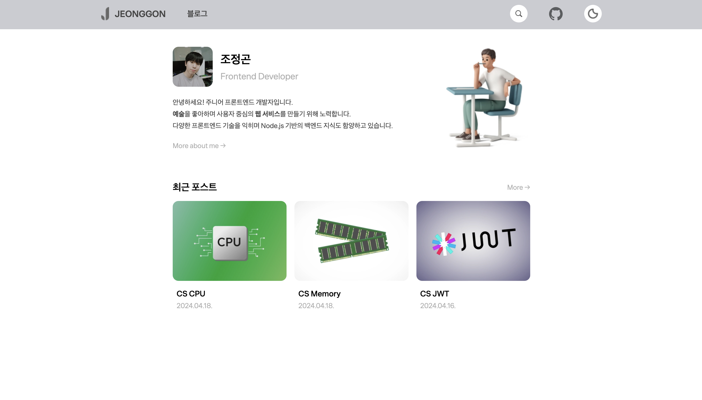

#  Jeonggon Gatsby Dev Blog

<br/>

> 나만의 커스텀 블로그를 만들어 보고 싶어 Gatsby를 이용하여 직접 제작한 블로그 템플릿

- `1차 작업기간` : 2024.04.27 ~ 2024.05.12

<br/>

## 📌 커밋 컨벤션

| 키워드      | 설명                 |
|----------|--------------------|
| `add`    | 컴포넌트, 페이지, 레이아웃 추가 |
| `edit`   | 컴포넌트, 페이지, 레이아웃 수정 |
| `style`  | 스타일 편집             |
| `feat`   | 데이터 쿼리 및 새로운 기능 추가 |
| `fix`    | 에러, 오류, 버그 해결      |
| `deploy` | 배포                 |
| `docs`   | 문서 수정              |

<br/>

## ⚙️ 주요 기능

1. 최근 포스트 목록 홈 화면에 출력
2. Markdown 내용을 HTML로 출력
3. 다크모드
4. 포스트별로 보기
5. 카테고리별로 보기
6. TOC(Table Of Content) 생성
7. giscus 위젯을 통한 댓글 기능

<br/>

## 🛠️ 개발 환경

<h3 style="display: flex; align-items: center; gap: 6px">
Gatsby (v5.13.3)</h4>

- Gatsby는 React 기반의 JAM(JS, APIs, Markup) stack 정적 사이트 생성 프레임워크로 컴포넌트 기반의 개발을 할 수 있으며, GraphQL을 이용해 데이터를 쿼리할 수 있는 것이
  특징이다.
- 큰 규모의 커뮤니티를 형성하고 있으며 이미지 최적화, SEO 등을 위한 다양한 플러그인을 제공한다.
- 다만, 이용하기 위해서는 학습이 요구된다.

<h3 style="display: flex; align-items: center; gap: 6px">
GraphQL</h4>

- Gatsby는 기본적으로 GraphQL을 사용하여 요청을 최적화하고 많은 정보 중 필요한 데이터만 선별적으로 쿼리할 수 있다.
- 개발자를 위해 GraphiQL과 같은 도구를 제공한다.
- 단점으로는 캐싱의 어려움과 높은 자유도에 따른 보안 문제가 발생할 수 있으나, 블로그와 같은 규모의 정적 사이트를 제작하는데는 괜찮다고 판단되었다.

<h3 style="display: flex; align-items: center; gap: 6px">
TypeScript</h4>

- JavaScript는 너무 자유도가 높은 언어이기에 문제가 있는 코드에서도 에러를 반환하지 않을 수 있다.
- TypeScript를 사용함으로써 타입 오류를 발견하여 컴파일시, 런타임 에러를 줄이고 안정성을 높일 수 있다.
- 대규모 서비스 혹은 많은 JavaScript 유저들이 TypeScript를 도입하고 큰 커뮤니티를 형성하고 있다.

<h3 style="display: flex; align-items: center; gap: 6px">
Emotion.js (v11.11.5)</h4>

- JavaScript 기반으로 스타일링을 할 수 있다. (CSS-in-JS)
- Styled Component와 CSS 함수 등 다양한 스타일링 방식을 지원한다.
- 매우 경량화된 라이브러리로 번들 크기를 최소화하여 로딩 속도와 성능에 우수하다.

<h3 style="display: flex; align-items: center; gap: 6px">
Netlify</h4>

- Netlify는 Gatsby와 같은 JAM stack 애플리케이션, 정적 사이트를 배포할 수 있는 클라우드 배포 플랫폼이다.
- 코드를 GitHub에 푸쉬하면 자동으로 빌드 및 배포가 이루어진다.
- 분산된 CDN(Content Delivery Network)을 통해 빠르고 안정적인 배포가 가능하다.
- 소규모 프로젝트 배포에 적합하다.

<br/>

## 🎨 디자인

<p align="center">
    <br/>
    <span>Figma로 제작한 블로그 UI</span>
</p>

<br/>

## 🧩 프로젝트 구조

```
📦 src
  │
  ├─ 📂 components
  │  │
  │  ├─ 📂 Blog
  │  │  │
  │  │  ├─ 📂 Category
  │  │  │  ├─ CategoryItem.tsx
  │  │  │  └─ CategoryList.tsx
  │  │  │
  │  │  ├─ 📂 Post
  │  │  │  ├─ PostCard.tsx
  │  │  │  ├─ PostCards.tsx
  │  │  │  ├─ PostComments.tsx
  │  │  │  ├─ PostContent.tsx
  │  │  │  ├─ PostHeader.tsx
  │  │  │  ├─ PostList.tsx
  │  │  │  ├─ PostMobileToc.tsx
  │  │  │  ├─ PostPagination.tsx
  │  │  │  ├─ PostPrevNextBtn.tsx
  │  │  │  ├─ PostPrevNextBtns.tsx
  │  │  │  ├─ PostProfile.tsx
  │  │  │  ├─ PostSameCategory.tsx
  │  │  │  ├─ PostTag.tsx
  │  │  │  ├─ PostTags.tsx
  │  │  │  └─ PostToc.tsx
  │  │  │
  │  │  ├─ Tab.tsx
  │  │  ├─ Tabs.tsx
  │  │  ├─ Tag.tsx
  │  │  └─ TagMenu.tsx
  │  │
  │  ├─ 📂 Common
  │  │  ├─ Footer.tsx
  │  │  ├─ Header.tsx
  │  │  ├─ Search.tsx
  │  │  └─ TopBtn.tsx
  │  │
  │  └─ 📂 Index
  │     ├─ CarouselItem.tsx
  │     ├─ CarouselItems.tsx
  │     └─ Profile.tsx
  │
  ├─ 📂 hooks
  │  └─ usePagination.ts
  │
  ├─ 📂 pages
  │  ├─ 404.tsx
  │  ├─ about.tsx
  │  ├─ categories.tsx
  │  ├─ category.tsx
  │  ├─ index.tsx
  │  ├─ posts.tsx
  │  └─ projects.tsx
  │
  ├─ 📂 styles
  │  ├─ GlobalStyle.tsx
  │  └─ theme.style.ts
  │
  ├─ 📂 templates
  │  ├─ BlogTemplate.tsx
  │  ├─ PostTemplate.tsx
  │  └─ Template.tsx
  │
  └─ emotion.d.ts
```

<br/>

## 📎 URL 구조

| 페이지           | 요청 URL                       | 
|---------------|------------------------------|
| 홈             | /                            |
| 블로그 - 포스트별    | /posts/                      |
| 블로그 - 태그      | /posts/?tag={태그}             |
| 블로그 - 카테고리별   | /categories/                 |
| 블로그 - 카테고리    | /categories/?category={카테고리} |
| 블로그 - 포스트 디테일 | /:카테고리/:slug/                |

<br/>

## 🖥️ 페이지

### 1. 홈

|                              웹                               |                                    모바일                                     |
|:------------------------------------------------------------:|:--------------------------------------------------------------------------:|
|  |  |

### 2. 포스트별

|                               웹                                |                                     모바일                                      |
|:--------------------------------------------------------------:|:----------------------------------------------------------------------------:|
|  |  |

### 3. 카테고리별

|                                    웹                                     |                                         모바일 화면                                         |
|:------------------------------------------------------------------------:|:--------------------------------------------------------------------------------------:|
|  |  |

### 4. 카테고리

|                                  웹                                   |                                        모바일                                         |
|:--------------------------------------------------------------------:|:----------------------------------------------------------------------------------:|
|  |  |

### 5. 포스트

|                              웹                               |                                    모바일                                     |
|:------------------------------------------------------------:|:--------------------------------------------------------------------------:|
|  |  |

### 6. 검색

|                                웹                                 |                                      모바일                                       |
|:----------------------------------------------------------------:|:------------------------------------------------------------------------------:|
|  |  |

### 7. 다크모드

|                                  웹                                   |                                        모바일                                         |
|:--------------------------------------------------------------------:|:----------------------------------------------------------------------------------:|
|  |  |

### 8. 404 페이지

|                             웹                              |                                   모바일                                    |
|:----------------------------------------------------------:|:------------------------------------------------------------------------:|
|  |  |

<br/>

## 💡 개발 이슈

### 1. Theme 설정

### 2. 이미지 최적화 및 가져오기

### 3. 블로그 탭 (포스트별, 카테고리별)

### 4. 포스트 아이템에서 태그 목록 숨기기

### 5. top 버튼

### 6. GraphQL 쿼리

### 7. URL 데이터 파싱하기

### 8. Slug

### 9. Markdown 문서를 HTML로 출력하기

### 10. Meta 태그

### 11. favicon 출력

### 12. 검색 기능

### 13. display: none과 visibility: hidden의 차이

### 14. TOC (Table Of Contents)

### 15. 페이지네이션 (Pagination)

### 16. 빌드 시, window 에러

### 17. 다크모드

<br/>

## 💭 회고

### 1. Keep

### 2. Problem

### 3. Try