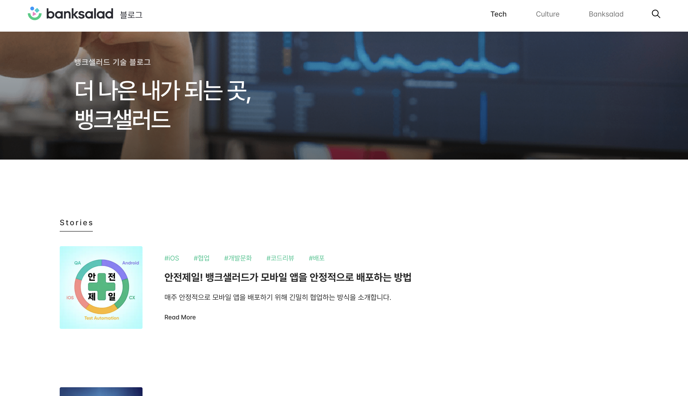
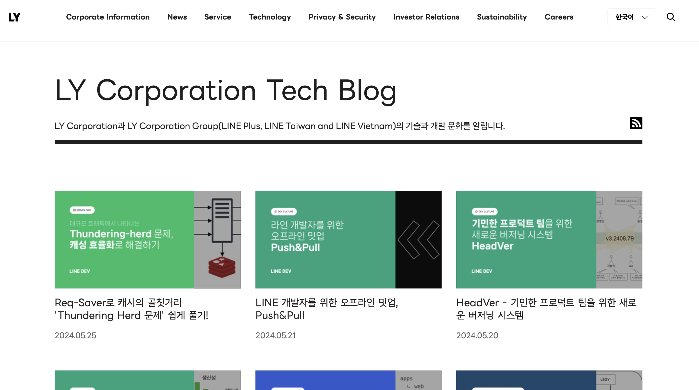
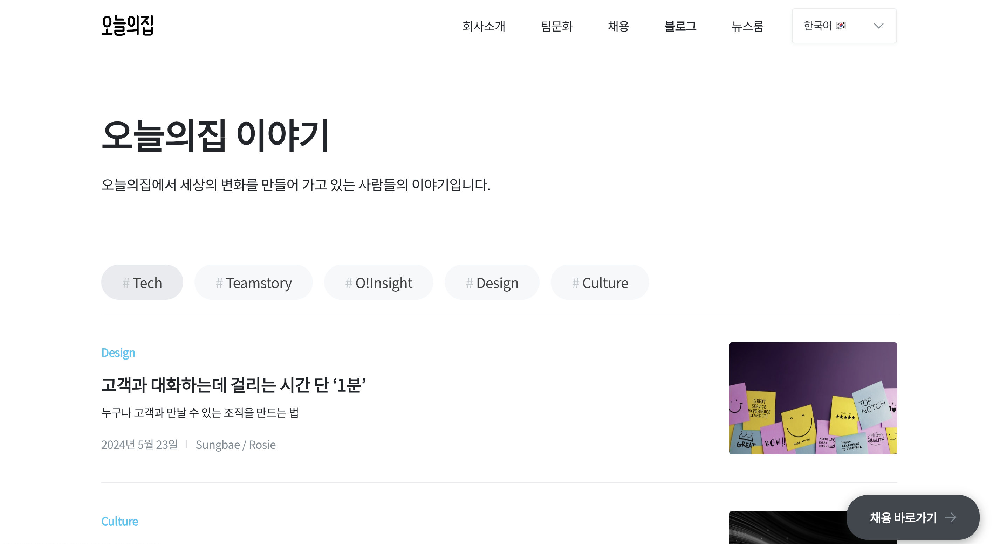
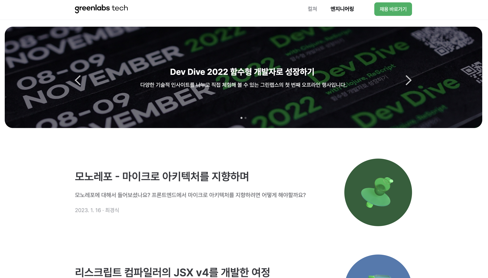

# Gatsby로 블로그 만들기

## ✏️ 블로그, 왜 만들어?

기술 블로그?, 개발 블로그? 개발자라면 한 번쯤은 들어봤을 말이다.

새로운 기술 및 지식에 대해 알고 싶거나 에러에 부딪혔을 때, 개발자들은 검색과 리서치 과정에서 수많은 개발 블로그들을 마주하곤
한다.

어쩌면 내가 개발에 관심을 가지게 된 이유 중 하나가 아닐까 싶다.

> 내가 생각하는 개발 문화 : 서로의 생각과 경험, 기술을 공유하고 도움을 주는 성숙한 커뮤니티 👍

대부분의 개발자들이 그렇듯이 처음 개발을 배우는 과정에서 많은 언어와 개념들이 나에게는 낮설게 느껴졌고, 나중에 다시 지식을 복기할 수 있도록 문서화를 해야겠다는 생각이 들었다.

따라서 나도 개발 블로그를 해보자 라는 마음으로 여러 플랫폼을 찾아보았다. 벨로그, 티스토리, 네이버블로그, 브런치 등... 너무나도 다양한 선택지가 있다.
각각의 플랫폼마다 성격과 장단점이 있지만, 나에게는 개발자들에게 특화된 벨로그가 매력적으로 다가왔고, 벨로그로 개발 블로그를 시작했었다.

하지만 개발을 공부할수록 "블로그 역시 개발 기술로 만들어진 결과물이잖아 그럼 이걸 만드는 것 역시 공부가 되겠다"는 생각과 함께 `나만의 커스텀화된 블로그`를 만들게 되었다.

<br/>
<br/>

## 🤔 어떻게 만들어?

블로그 사이트의 특징을 보면 미리 작성된 포스팅을 클라이언트에게 전달하는 `정적 사이트(Static Website)`이다.

이러한 정적 사이트를 만드는데는 이용되는 생성기(Boilerplate, generator)로 `Jekyll`, `Hugo`, `Gatsby` 등이 있다.

<br/>

### 1. Jekyll

- `Ruby` 기반의 정적 사이트 생성기
- Github Pages를 통해 무료로 호스팅 할 수 있어서 많은 개발자들이 사용하고 있다.
- 다양한 커스텀 테마를 지원하고 있다.

### 2. Hugo

- `Go` 언어 기반의 정적 사이트 생성기
- 이 역시, 빠른 속도와 아양한 테마 및 기능을 지원하고 있다.

### 3. Gatsby

- `React` 기반의 정적사이트 생성기
- JAM(JavaScript + APIs + Markup) Stack을 활용한다.
- 이미지 최적화, SEO 등을 위한 다양한 플러그인을 제공한다.

<br/>

나의 목표는 나만의 커스텀 블로그를 만들고, 만드는 과정에서 학습할 수 있는 것이였기에 React를 기반으로하는 `Gatsby`를 통해 블로그를 만들기로 하였다.
또한 Gatsby에서도 다양한 테마를 지원하지만 커스텀을 위해 템플릿은 사용하지 않기로 하였다.

<br/>
<br/>

## 🙋🏻 Gatsby를 이용한 사례들

기업에서도 Gatsy를 이용하여 자사의 기술 블로그 및 채용 페이지들을 이용하고 있었으며, 이러한 사례를 통해 Gatsby를 더 적극적으로 도입하게 되었다.

|                     뱅크샐러드                     |
|:---------------------------------------------:|
|  |
|          https://blog.banksalad.com/          |

|                  라인                   |
|:-------------------------------------:|
|  |
|   https://techblog.lycorp.co.jp/ko    |

|                      오늘의집                      |
|:----------------------------------------------:|
|  |
|      https://www.bucketplace.com/culture/      |

|                     그린랩스                     |
|:--------------------------------------------:|
|  |
|        https://tech.greenlabs.co.kr/         |

<br/>
<br/>

## 🏁 Gatsby 프로젝트 시작하기

### 1. 프로젝트 생성

```bash
$ npx gatsby-cli new "[프로젝트 명]"
```

### 2. 프로젝트 실행

```bash
$ gatsby develop

# yarn develop 도 마찬가지로 가능
```

<br/>

계속해서 블로그를 만드는 과정에서 필요하다고 생각한 기능과 이를 해결하기 위한 과정들을 소개해보고자 한다.

<br/>
<br/>

---

### JeonggonCho_Blog 템플릿 레포지토리

https://github.com/JeonggonCho/JeonggonCho_Blog