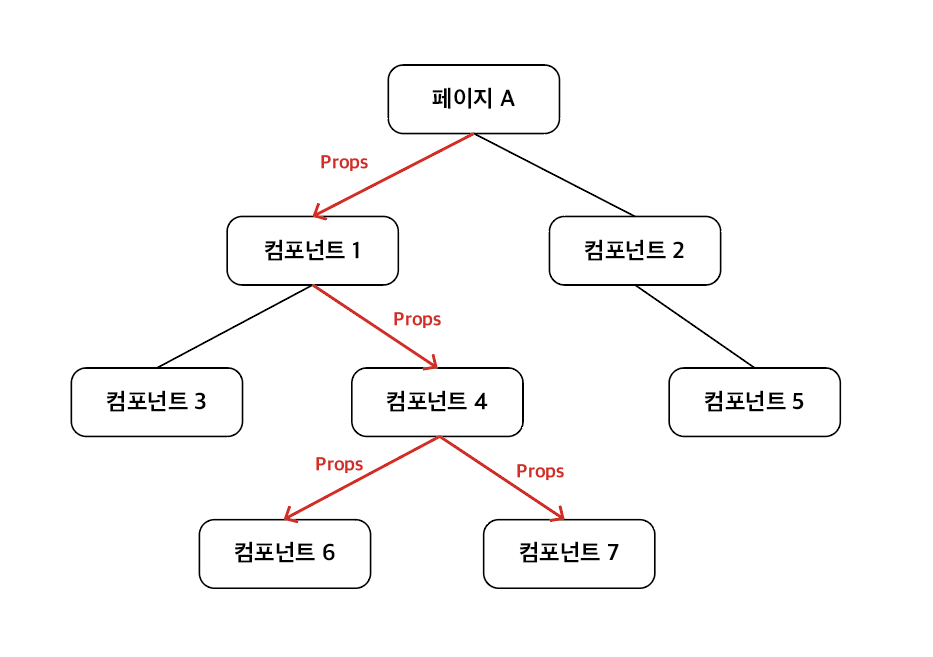

# 테마(theme) 설정하기

## 1. 테마(theme)?

스타일링을 하면 `자주 사용`하게 되는 색상, 폰트 사이즈 등이 있다. 이는 UI와 밀접한 관련이 있다.

예를 들어 대제목은 20px로 소제목은 16px로 본문은 14px로 하거나, 서비스의 주요 색상을 몇 개 정하여 사용하는 것과 같이 말이다.

하지만 서비스를 개발하면서 이러한 스타일값들을 모두 기억하여 코드를 작성하면 `생산성도 낮아지고`, 추후에 `유지보수`하는 상황에도 어려움을 야기할 수 있다.

<br/>

```css
/*예시*/

/*A 페이지의 스타일*/
h1 {
    font-size: 20px;
    color: #f2d3d4;
}

/*B 페이지의 스타일*/
h1 {
    font-size: 20px;
    color: #f2d3d4;
}

/*C 페이지의 스타일*/
h1 {
    font-size: 20px;
    color: #f2d3d4;
}
```

위와 같이 공통된 값을 자주 사용하는데 만약 h1의 글자 크기를 변경하거나 색상을 변경할 경우, 스타일링 코드에서 h1을 모두 일일이 찾아서 값을 바꿔주어야 할 것이다. 그렇기에 테마가 필요하다.

<br/>
<br/>

## 2. Context, Provider

테마를 만들기 전에 필요한 지식이 있다. React의 Context와 Provider 개념이다.

React는 기본적으로 컴포넌트 기반으로 구성되어있으며, 부모 컴포넌트에서 자식 컴포넌트로 Props를 전달하여 전달된 데이터 값을 사용하게 된다.
하지만, 여러 컴포넌트에서 자주 사용되어야하는 Props 값들은 계속해서 부모 컴포넌트에서 자식 컴포넌트로 그 자식 컴포넌트로 props를 전달하면 `Prop Drilling`이 발생한다. Prop Drilling은
코드의 복잡도를 높이고 가독성을 떨어뜨리는 문제가 있다.

<br/>

<p align="center">
    <br/>
    <span>Prop Drilling</span>
</p>

<br/>

일일이 Props를 전달하지 않고 `전역`에서 사용할 수 있는 Props를 만들기 위해 사용되는 개념이 `Context`와 `Provider`이다.

<br/>

### 2-1. createContext()

해당 메서드는 Context 객체를 만드는 역할을 하며, 파라미터인 defaultValue는 맞는 context provider가 트리 안에 없을 경우, 반환하는 값이다.

```js
// 기본 createContext() 구조

const myContext = createContext(defaultValue);

// 예시

const ThemeContext = createContext('light');
```

- defaultValue가 사용되는 경우

```js
// createContext 예시

const UserContext = createContext('Guest');

function DisplayUser() {
  const username = useContext(UserContext);
  return <div>{`Hello, ${username}!`}</div>;
}

// 출력: Hello, Guest!
```

<br/>

### 2-2. Context.Provider

Provider는 Context 객체의 컴포넌트로서 value 속성에 전달할 값을 넣고, 해당 값을 사용하게할 컴포넌트를 감싸면 부모 컴포넌트에서 자식 컴포넌트로 props를 전달하지 않더라도 해당 value를
사용할 수 있다.

```js
// Provider 예시

<myContext.Provider value={특정값}>
  <Header/>
  {children}
  <Footer/>
</myContext.Provider>

// 여러 Context Provider 중첩하기
<myContext1.Provider value={특정값1}>
  <myContext2.Provider value={특정값2}>
    <Header/>
    {children}
    <Footer/>
  </myContext2.Provider>
</myContext1.Provider>
```

<br/>

### 2-3. 전체적인 Context와 Provider 사용 구조

```js
// 예시

import React, { createContext, useContext } from 'react';

// 1. Context 객체 생성하기
const UserContext = createContext('Guest');

// 3. User 컴포넌트
function User() {
  // useContext의 파라미터로 Context 객체를 받아 객체의 값을 받아오기
  const username = useContext(UserContext);
  return <div>{`Hello, ${username}!`}</div>; // 출력: Hello, jeonggon!
}

// 2. Provider로 전달할 컴포넌트 혹은 페이지를 감싸고 값 전달하기
function App() {
  return (
    <UserContext.Provider value="jeonggon">
      <User/>
    </UserContext.Provider>
  );
}

export default App;
```

<br/>
<br/>

## 3. ThemeProvider

위의 내용을 정리하면 React에서는 `Context 객체`를 만들고, `Provider 컴포넌트`로 전체 컴포넌트를 감싸고 value 속성에 `전달`할 값을 지정하고, 해당 값을 사용할
컴포넌트에서 `useContext() hook`을 통해 값을 가져와 사용할 수 있다.

그렇다면 `ThemeProvider`는 무엇일까?

앞선 Context, Provider와 동일한 기능으로 Emotion.js(스타일링 라이브러리)에서 제공하는 컴포넌트이다. 앞서 테마에서 설명한 것과 같이, 동일한 글자 사이즈, 색상 등 자주 사용되는 스타일 값들을
스타일링 코드 전역에서 사용할 수 있게 해준다.

<br/>

예시와 함께 알아보자

<br/>

1) 자주 사용되는 값들을 테마 객체로 지정하기

```js
const theme = {
  colors: {
    main: '#f2m3j5',
    sub: '#ddd3k4',
  },
  sizes: {
    big: '20px',
    medium: '16px',
    small: '14px'
  }
};
```

<br/>

2) 해당 테마를 ThemeProvider를 통해 전달하기

```js
import { ThemeProvider } from '@emotion/react';

//...

<ThemeProvider theme={theme}>
  <Header/>
</ThemeProvider>
```

<br/>

3) 컴포넌트에서 theme 사용하기

```js
const Title = styled.h1`
  color: ${({ theme }) => theme.colors.main};
  font-size: ${({ theme }) => theme.sizes.big};
`;

const Header = () => {
  return (
    <Title>타이틀</Title>
  );
};
```

기존의 스타일링 코드에서 '20px', '#ffffff'와 같이 적는 것보다 길어질 수 있다. 하지만 만약 main의 색상을 바꾸고 싶으면 theme 객체의 colors의 main 값만 바꾸면 전역에서 main
색상을 쉽게 변경할 수 있으며, 뿐만아니라 특정 값을 암기할 필요없이 'big', 'main'과 같이 추상화하여 사용할 수 있기에 생산성에도 좋다.

<br/>
<br/>

## 4. 만약, TypeScript를 사용중이라면?

TypeScript를 사용하면 theme 객체를 사용할 경우, `theme 객체`의 타입을 지정하지 않았기에 `타입 에러`가 발생하게 된다.

이를 해결하기 위해서는 타입 정의 파일(d.ts)이 필요하다.

`emotion.d.ts` 또는 `theme.d.ts`의 이름(이름은 자유롭게 작성 가능)으로 타입 정의 파일 생성 후 해당 theme의 타입을 지정해준다.

```ts
// 타입 정의 파일 예시

import "@emotion/react"

declare module "@emotion/react" {
  export interface Theme {
    colors: {
      main: string;
      sub: string;
    }
    sizes: {
      big: string;
      medium: string;
      small: string;
    }
  }
}
```

<br/>
<br/>

---

## Source

### - React 문서 : Context

https://react.dev/reference/react/createContext

### - Emotion.js 문서 : Theming

https://emotion.sh/docs/theming

### - JeonggonCho_Blog 템플릿 레포지토리

https://github.com/JeonggonCho/JeonggonCho_Blog