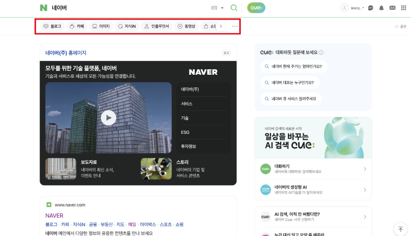
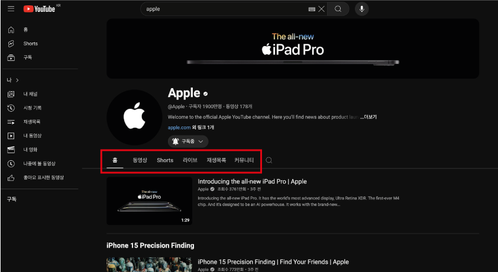
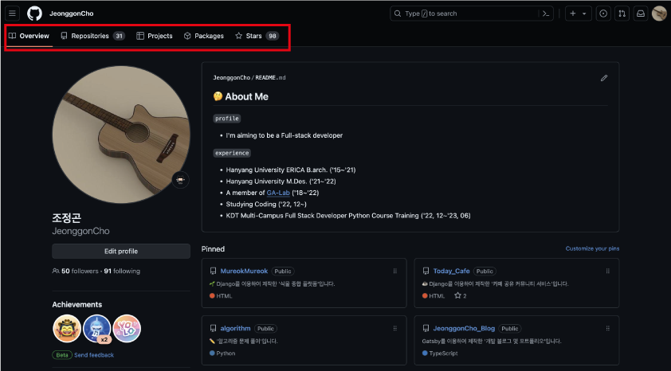
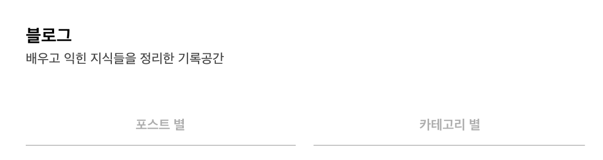
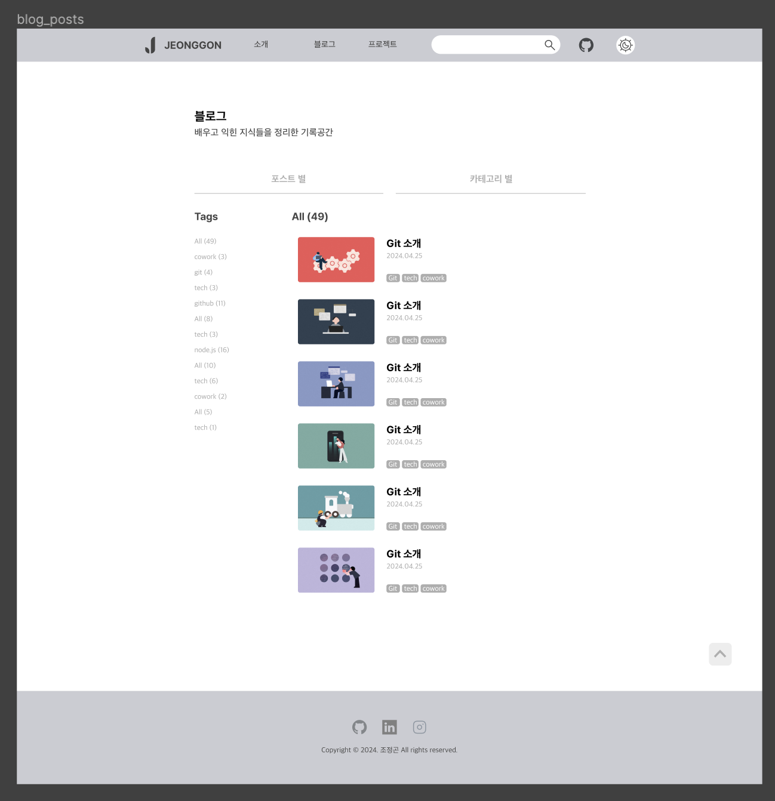
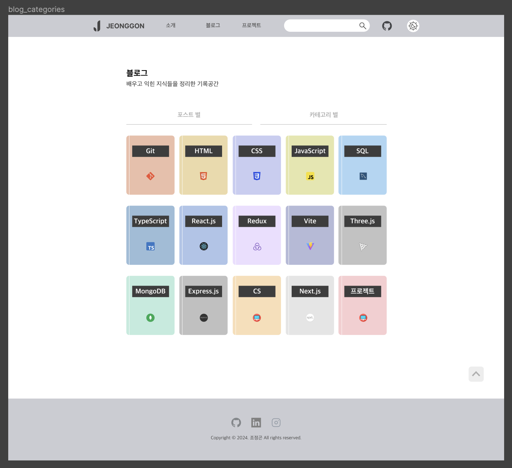
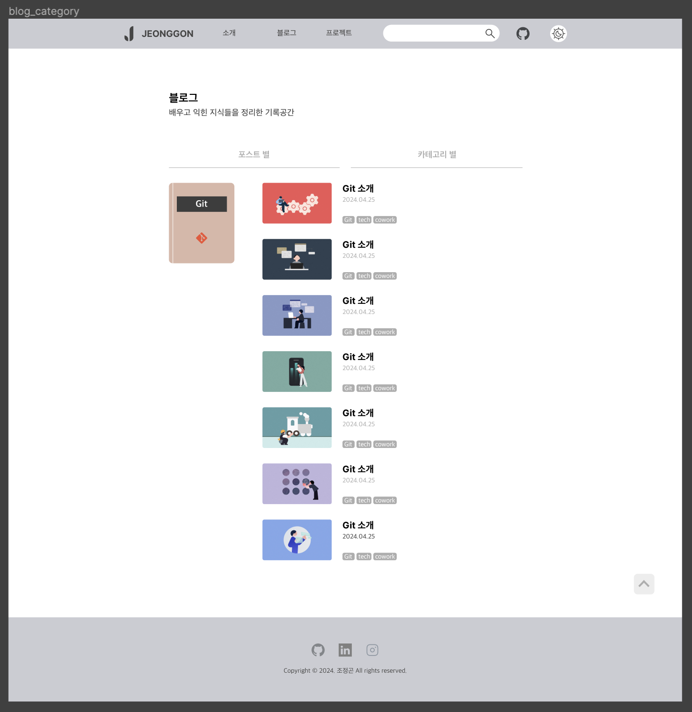

# 블로그의 탭 만들기

웹 사이트들을 보면 `탭 기능`을 자주 볼 수 있다.

<br/>

|                네이버                 |
|:----------------------------------:|
|  |

|                 유튜브                  |
|:------------------------------------:|
|  |

|                 깃허브                 |
|:-----------------------------------:|
|  |

<br/>

내 블로그에도 탭 기능을 넣어 `포스트별`로 보기, `카테고리별`로 보기로 분류된 탭을 제공하고자 하였다.

<br/>

## 1. 탭 구조 잡기

해당 UI 프로세스는 `벨로그` 플랫폼의 구조에서 아이디어를 얻어 나만의 스타일로 개발해보았다.

<br/>

1. 블로그 상단에 포스트별, 카테고리별 두 가지의 탭을 위치시킨다.

<p align="center">
    
</p>

<br/>
<br/>

2. 포스트별 탭을 클릭하면 블로그의 모든 태그들과 각각의 포스트를 낱개로 보여준다.

<p align="center">
    
</p>

<br/>
<br/>

3. 카테고리별 탭을 클릭하면 카테고리 목록을 책 표지처럼 보여준다.

<p align="center">
    
</p>

<br/>
<br/>

4. 카테고리별 페이지에서 카테고리를 클릭하면 해당 카테고리의 포스트를 낱개로 보여준다.

<p align="center">
    
</p>

<br/>
<br/>

## 2. 탭 기능을 구현하는 방법

초기에 탭 기능을 구현하는 방법으로 생각했던 것은 `useState`를 사용하는 것이였다.

### 2-1. useState 사용하는 방법

```tsx
// useState로 탭 구현하기 간단한 예시

import { useState } from 'react';

const Blog = () => {
  // useState로 boolean 값 지정
  const [showPosts, setShowPosts] = useState<boolean>(true);
  const [showCategories, setShowCategories] = useState<boolean>(false);

  // 포스트별 클릭 시, 포스트별 true, 카테고리별 false로 전환
  const handleClickPosts = () => {
    setPosts(true);
    setCategories(false);
  };

  // 카테고리별 클릭 시, 포스트별 false, 카테고리별 true로 전환
  const handleClickCategories = () => {
    setPosts(false);
    setCategories(true);
  };

  return (<main>
    {/*탭 버튼*/}
    <div onClick={handleClickPosts}>포스트별</div>
    <div onClick={handleClickCategories}>카테고리별</div>

    {/*해당 탭이 true일 경우, 해당 탭의 내용을 출력하기*/}
    {showPosts && <div>포스트별 컨텐츠</div>}
    {showCategories && <div>카테고리별 컨텐츠</div>}
  </main>);
};

export default Blog;
```

이렇게 했을 경우, 탭을 클릭 시, 내용이 전환되어 탭의 기능을 할 수 있었다.

<br/>

하지만 문제점이 있었다.

> <b>문제점</b>
>
> useState로 탭을 전환할 경우, URL의 변경이 일어나지 않아 히스토리가 남지 않았고, `뒤로가기`를 하면 직전의 화면이 아닌, 직전 히스토리의 URL로 이동했다. 또한 마찬가지로 `새로고침`을 할 경우,
> 초기 설정 (포스트별)으로 가버리는 등 불편한 사용자 경험을 주는 문제가 있었다.

<br/>
<br/>

### 2-2. 다른 사이트들은 어떻게 탭을 구현했을까?

이러한 문제점을 발견하고 그렇다면 다른 주요한 웹사이트들에서는 탭 기능을 어떻게 구현하고 있는지 알아보았다.

<br/>

### 네이버 - Query String

- naver.com/search.naver`?ssc=tab.nx.all`
- naver.com/search.naver`?ssc=tab.cafe.all`
- ...

<br/>

### 깃허브 - Query String

- github.com/user`?tab=repositories`
- github.com/user`?tab=projects`
- ...

<br/>

### 유튜브 - URL 경로

- youtube.com/@channel/`videos`/
- youtube.com/@channel/`playlists`/
- ...

<br/>

### 벨로그 - URL 경로

- velog.io/@user/`posts`/
- velog.io/@user/`series`/
- ...

<br/>

몇몇 사이트들의 탭 구현 방식을 보았을 때, 크게 `Query String`, `URL 경로`로 구현한 것을 볼 수 있었다. 두 가지 방식 모두 URL을 이용하며 히스토리에 로그를 남기기에 뒤로가기 또는
새로고침에도 자연스럽게 동작한다. 두 가지 중 어떠한 방식을 사용해도 괜찮다고 판단되었다.

<br/>

나는 두 가지 방식 중 `URL 경로`를 사용하여 포스트별, 카테고리별 탭 기능을 구현하기로 하였다. 또한 태그 검색, 단일 카테고리 페이지는 `Query String`으로 가변적으로 처리하였다.

| 탭      | URL                          |
|--------|------------------------------|
| 포스트별   | /posts/                      |
| 포스트 태그 | /posts/?tag={태그}             |
| 카테고리별  | /categories/                 |
| 카테고리   | /categories/?category={카테고리} |

<br/>

추가적으로 Gatsby에서는 페이지를 이동할 수 있는 <Link> 컴포넌트를 제공하며 to 속성에 URL을 작성하면 해당 URL로 라우팅 시킨다.

```tsx
// 예시

import { Link } from "gatsby";

<Link to={`/categories/?category=${category}`}>카테고리 버튼</Link>
```

또한 `src/pages/` 디렉토리에 페이지 컴포넌트를 만들면 자동으로 라우팅 할 수 있는 페이지가 생성된다.

예를 들어 `src/pages/posts.tsx` 와 같이 디렉토리와 파일이 있는 경우, `/posts/`의 페이지가 생긴다.

<br/>
<br/>

---

### - JeonggonCho_Blog 템플릿 레포지토리

https://github.com/JeonggonCho/JeonggonCho_Blog