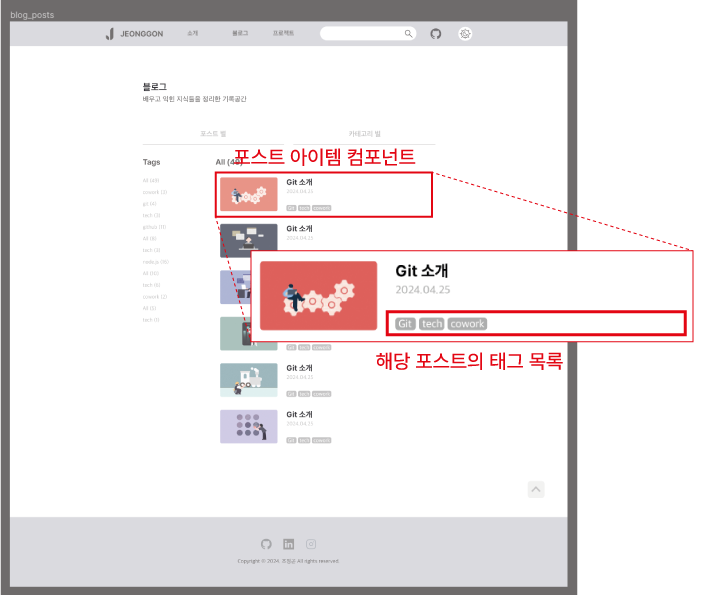
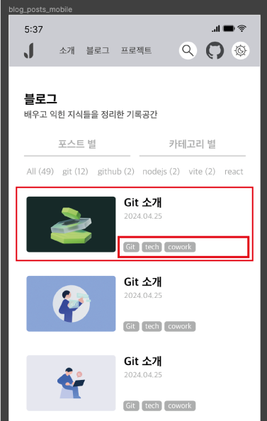
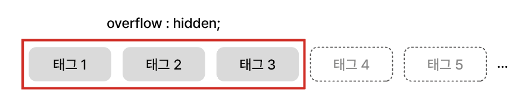
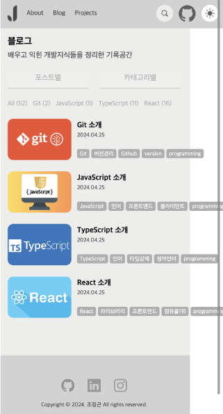
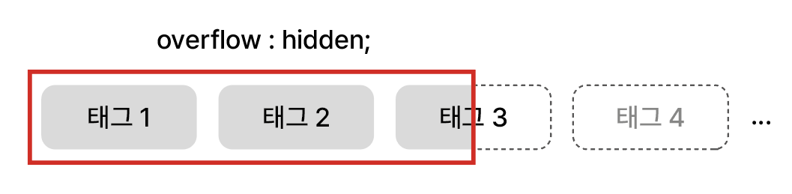
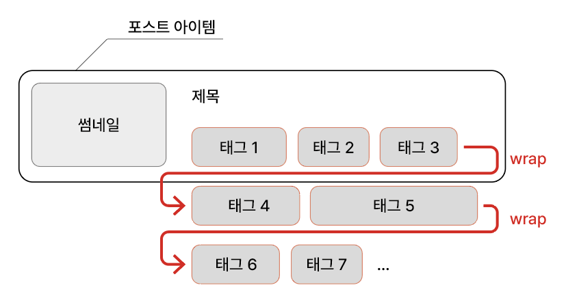
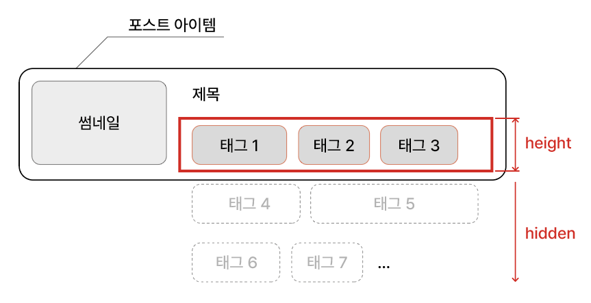

# 태그 출력 시, 앞에 위치한 태그들만 보여주고 나머지 숨기기

포스트 아이템 컴포넌트에서 태그 해당 포스트의 태그들을 보여줄 때, 모든 태그를 보여주는 것이 아니라, 포스트 아이템의 크기만큼 출력하고 크기를 벗어나는 태그들은 숨기도록 한다.

<br/>

<p align="center">
    <br/>
    <span>포스트 아이템과 내부의 태그 목록 디자인</span>
</p>

<br/>

<p align="center">
    <br/>
    <span>모바일 화면의 태그 목록</span>
</p>

<br/>
<br/>

## 1. overflow:hidden

기본적으로 css 스타일링으로 `overflow:hidden`을 떠올릴 수 있다.

<br/>

<p align="center">
    <br/>
    <span>overflow:hidden으로 넘치는 요소 숨기기</span>
</p>

<br/>

따라서 태그들을 감싸는 div를 아래와 같이 Styled Component로 스타일링하였다. flex를 통해 가로로 정렬하고, overflow와 width를 적용하였다.

```ts
// 태그들을 감싸는 div

const PostCardTagWrapper = styled.div`
    display: flex;
    gap: 4px;
    margin-bottom: 4px;
    overflow: hidden;
    width: 100%;
`;
```

<br/>

포스트 아이템 너비에 꽉차도록 width를 100%로 설정했었는데 정적인 값이 아닌 퍼센트 단위를 사용한 가변적인 값이여서인지 의도와는 다르게 overflow:hidden이 되지 않고, 아래의 이미지와 같이 포스트
아이템을 넘어서 태그들이 출력되었다.

<br/>

<p align="center">
    <br/>
    <span>overflow:hidden으로 넘치는 요소 숨기기</span>
</p>

<br/>

하지만, width 문제를 해결하여도 overflow:hidden만 적용했을 때는 아래와 같이 `태그가 잘려서 출력될 가능성`이 있다.

<br/>

<p align="center">
    <br/>
    <span>overflow:hidden으로 태그가 잘려서 출력되는 문제</span>
</p>

<br/>
<br/>

## 2. flex-wrap:wrap

위의 width 값 문제와 잘려서 출력될 문제를 동시에 해결하기 위한 방안으로 `flex-wrap:wrap` 속성을 적용하였다. flex-wrap은 내부의 정렬된 요소가 부모 요소를 넘칠 경우, 다음 줄을 생성하여
아래로 보내게 된다. 이렇게 하면 따로 width를 지정하지 않아도 되며, 태그가 잘려서 출력될 문제도 방지할 수 있다.

<br/>

<p align="center">
    <br/>
    <span>flex-wrap으로 태그 정렬하기</span>
</p>

<br/>

이제는 width 값 말고 `height 값`을 지정해주면 된다.

<br/>

```ts
// flex-wrap과 height 값 지정하기

const PostCardTagWrapper = styled.div`
    display: flex;
    gap: 4px;
    margin-bottom: 4px;
    flex-wrap: wrap;
    max-height: 22px;
    overflow: hidden;
`;
```

<br/>

<p align="center">
    <br/>
    <span>height 값 지정하기</span>
</p>

<br/>
<br/>

## 3. 태그 출력 결과

문제를 해결한 포스트 아이템의 태그 목록 출력은 다음과 같다.

<br/>

<p align="center">
    <br/>
    <span>태그 목록 출력 문제 해결</span>
</p>

<br/>
<br/>

<div align="center">
    <h3>잘못된 부분이 있거나, 다른 방법 및 의견이 있다면 아래의 댓글로 알려주세요. 👍</h3>
</div>

<br/>
<br/>

---

## Sources

### - JeonggonCho_Blog 템플릿 레포지토리

https://github.com/JeonggonCho/JeonggonCho_Blog