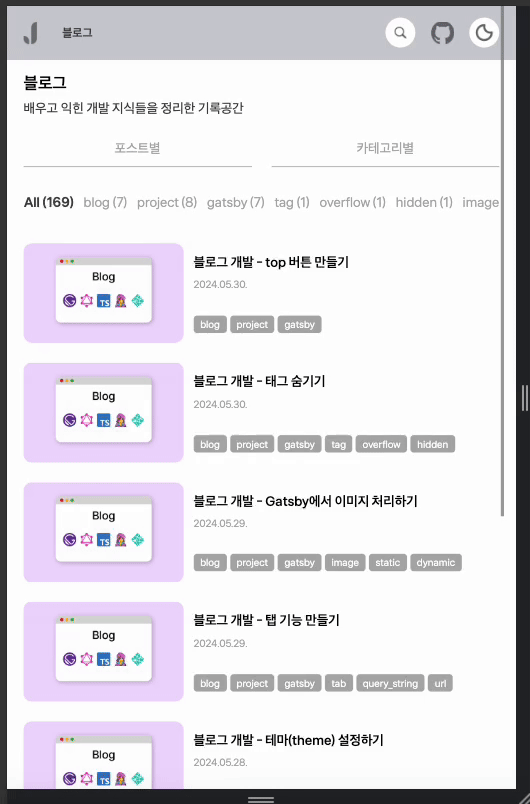

# Top 버튼 만들기

블로그의 경우, 컨텐츠에 따라서 매우 긴 페이지 길이를 가질 수 있기에 화면의 최상단으로 이동하는 top 버튼이 사용성에 있어서 필수라고 생각되었다.

<br/>

## ⬆️ 어떻게 구현하지?

### 1. 기본적인 구조 잡기

```tsx
// top 버튼 컴포넌트 기본 구조 예시

import { FC } from 'react'

const TopBtn: FC = () => {
  return (
    <div>top 버튼</div>
  );
};

export default TopBtn;
```

<br/>

### 2. 버튼 스타일링하기

스타일링은 디자인에 따라서 자유롭게 할 수 있으나, 주요 속성으로는 `position: fixed;`와 `z-index: 값;`이 필요하다.

fixed의 경우, right, bottom ... 과 같은 기준 값이 필요하며, z-index는 다른 요소에 가려지지 않도록 적당히 높은 값을 부여한다.

```tsx
// top 버튼 컴포넌트 스타일링 예시

import styled from "@emotion/styled";
import { css } from "@emotion/react";
import { StaticImage } from "gatsby-plugin-image";

const TopBtnWrapper = styled.div`
    display: flex;
    align-items: center;
    justify-content: center;
    width: 44px;
    height: 44px;
    border-radius: 8px;
    background-color: ${({ theme }) => theme.lightModeColors.background.lightGray};
    border: none;
    position: fixed;
    right: 64px;
    bottom: 64px;
    cursor: pointer;
    z-index: 3;
`;

const upArrow = css`
    width: 20px;
    height: 20px;
`;

// ...

return (
  <TopBtnWrapper>
    <StaticImage src="../../images/up-arrow.svg" alt="top" css={upArrow} />
  </TopBtnWrapper>
);
```

<br/>

### 3. 클릭 이벤트 연결하기

```tsx
// top 버튼 컴포넌트 이벤트 예시

// ...

// 클릭 시, 화면 최상단으로 스크롤 시키기
const handleTopBtn = () => {
  window.scrollTo({
    top: 0,
    behavior: "smooth"
  })
}

// ...

return (
  <TopBtnWrapper onClick={handleTopBtn}>
    <StaticImage src="../../images/up-arrow.svg" alt="top" css={upArrow} />
  </TopBtnWrapper>
);
```

<br/>

### 4. 조건부 렌더링 - useState, useEffect

3번까지 작성될 경우, 기본적인 top 버튼이 생성되어 작동되지만, 화면의 상단부에 있을 경우에는 안 보이도록 처리하고 싶었다.

따라서 useState로 버튼 보임의 상태를 관리하고, useEffect로 마운트 시, 스크롤 이벤트를 생성하고 언마운트 시, 메모리 절약을 위해 이벤트를 삭제하도록 처리하였다.

스크롤 이벤트는 200px을 내리면 보이고, 그 위로는 안 보이도록 window.scrollY를 이용해 분기 처리하였다.

```tsx
// top 버튼 컴포넌트 조건부 렌더링 예시

import { FC, useEffect, useState } from "react";

// ...

// 버튼을 보여줄지에 대한 상태를 boolean 값으로 관리
const [showBtn, setShowBtn] = useState(false);

// 화면 마운트 시, 스크롤 이벤트 생성
// 스크롤을 200px 내리면 true로 올리면 false로 전환
useEffect(() => {
  const handleShowBtn = () => {
    if (window.scrollY > 200) {
      setShowBtn(true)
    } else {
      setShowBtn(false)
    }
  }

  window.addEventListener("scroll", handleShowBtn)
  return () => {
    window.removeEventListener("scroll", handleShowBtn)
  }
});

// ...

// showBtn 값이 true이면 버튼이 렌더링되도록 하기
showBtn && (
  <TopBtnWrapper onClick={handleTopBtn}>
    <StaticImage src="../../images/up-arrow.svg" alt="top" css={upArrow} />
  </TopBtnWrapper>
)
```

<br/>

> <b>에러</b>
>
> `showBtn && <...>` 이 부분에서 false가 리턴될 수 있음 => 컴포넌트가 boolean 값을 리턴하지 않도록 처리해야 함

<br/>

### 5. 에러 해결하기

```tsx
// top 버튼 컴포넌트 에러 처리 예시

//...

if (!showBtn) {
  return null; // 이 부분을 추가해서 boolean 타입이 아닌 JSX.Element 타입을 반환하도록 함
}

return (
  <TopBtnWrapper onClick={handleTopBtn}>
    <StaticImage src="../../images/up-arrow.svg" alt="top" css={upArrow} />
  </TopBtnWrapper>
)
```

<br/>
<br/>

## 📄 Top 버튼 전체 코드 및 동작 화면

```tsx
// top 버튼 컴포넌트 예시

import { FC, useEffect, useState } from "react";
import { StaticImage } from "gatsby-plugin-image";
import styled from "@emotion/styled";
import { css } from "@emotion/react";

const TopBtnWrapper = styled.div`
    display: flex;
    align-items: center;
    justify-content: center;
    width: 44px;
    height: 44px;
    border-radius: 8px;
    background-color: ${({ theme }) => theme.lightModeColors.background.lightGray};
    border: none;
    position: fixed;
    right: 64px;
    bottom: 64px;
    cursor: pointer;
    z-index: 3;
`;

const upArrow = css`
    width: 20px;
    height: 20px;
`;

const TopBtn: FC = () => {

  const [showBtn, setShowBtn] = useState(false);

  const handleTopBtn = () => {
    window.scrollTo({
      top: 0,
      behavior: "smooth"
    })
  };

  useEffect(() => {
    const handleShowBtn = () => {
      if (window.scrollY > 200) {
        setShowBtn(true)
      } else {
        setShowBtn(false)
      }
    };

    window.addEventListener("scroll", handleShowBtn);
    return () => {
      window.removeEventListener("scroll", handleShowBtn);
    };
  });

  if (!showBtn) {
    return null;
  }

  return (
    <TopBtnWrapper onClick={handleTopBtn}>
      <StaticImage src="../../images/up-arrow.svg" alt="top" css={upArrow} />
    </TopBtnWrapper>
  );
};

export default TopBtn;
```

<br/>

<p align="center">
    <br/>
    <span>Top 버튼 동작</span>
</p>

<br/>
<br/>

---

## Sources

### - mdn 공식문서 : Window.scrollTo()

https://developer.mozilla.org/ko/docs/Web/API/Window/scrollTo

### - mdn 공식문서 : Window.scrollY

https://developer.mozilla.org/ko/docs/Web/API/Window/scrollY

### - JeonggonCho_Blog 템플릿 레포지토리

https://github.com/JeonggonCho/JeonggonCho_Blog