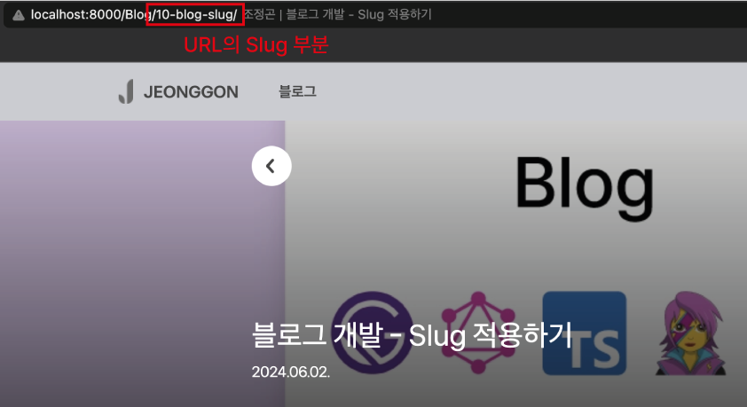

# Slug? 그게 뭐지?

Slug는 URL에서 페이지의 `고유 식별자 역할`을 하는 부분으로 사람들이 읽고 이해할 수 있는 간단하고 단순한 형태로 만들어진다.

<br/>

## 1. Slug 특징

1. 간결성 : 가능한한 짧고 간결하게 너무 길면 URL이 복잡해지고 기억하기 어려워진다.
2. 명확성 : 페이지의 내용을 명확하고 함축적으로 나타내야 하며, Slug만 보고도 어떠한 내용인지 유추할 수 있어야 한다.
3. SEO 친화적 : 검색 엔진 최적화에 도움이 된다. Slug에 주요 키워드를 포함시키면 검색 엔진에서 쉽게 발견할 수 있어 상위권에 노출시킬 수 있다.
4. 하이픈(-) 사용 : 공백이 하이픈으로 대체된다.
5. 소문자 사용 및 특수문자 제거 : 일관성을 위해 소문자를 사용하고, 특수문자는 사용하지 않는다.

<br/>
<br/>

## 2. Slug 예시

만약 블로그의 제목이 `프로그래밍 꾸준히 공부하기`라면,

- Slug : `프로그래밍-꾸준히-공부하기`
- URL : `https://localhost.com/프로그래밍-꾸준히-공부하기`

와 같이 사용될 수 있다.

<br/>
<br/>

## 3. Gatsby에서 Slug 사용방법

1. gatsby-source-filesystem 플러그인을 설치한다.

```bash
$ npm install gatsby-source-filesystem
```

<br/>

2. gatsby-node.js 파일에서 Slug 생성

```js
// gatsby-node.js

// ...

// gatsby-source-filesystem 플러그인에서 createFilePath 함수 가져오기
const { createFilePath } = require(`gatsby-source-filesystem`);

// ...

// onCreateNode 함수 내보내기
exports.onCreateNode = ({ node, getNode, actions }) => {

  // actions에서 createNodeField 함수 가져오기
  const { createNodeField } = actions

  // node 내부의 형식이 마크타운이면 실행하기
  if (node.internal.type === "MarkdownRemark") {
    // createFilePath 함수로 해당 인자들로 슬러그 생성
    const slug = createFilePath({
      node,
      getNode,
      basePath: "src/contents"
    })

    // createNodeField 함수에 파라미터에 슬러그를 담아서 호출하기
    createNodeField({
      node,
      name: "slug",
      value: slug
    })
  }
};
```

<br/>

3. GraphQL로 Slug 호출 가능

```graphql
# Slug 호출 예시

{
    allMarkdownRemark {
        edges {
            node {
                fields {
                    slug
                }
            }
        }
    }
}
```

<br/>

4. Slug 확인하기

`src/contents/Blog/10-blog-slug/index.md` 파일이 있을 경우, Slug는 마크다운이 있는 폴더명이 된다.

<br/>

<p align="center">
    <br/>
    <span>브라우저로 살펴본 URL의 Slug</span>
</p>

<br/>
<br/>

---

## Sources

### - mdn 공식문서 : 간편 URL (Slug)

https://developer.mozilla.org/ko/docs/Glossary/Slug

### - Gatsby 공식문서 : createFilePath

https://www.gatsbyjs.com/plugins/gatsby-source-filesystem/#createfilepath

### - Gatsby 공식문서 : Creating Slugs for Pages

https://www.gatsbyjs.com/docs/creating-slugs-for-pages/

### - JeonggonCho_Blog 템플릿 레포지토리

https://github.com/JeonggonCho/JeonggonCho_Blog