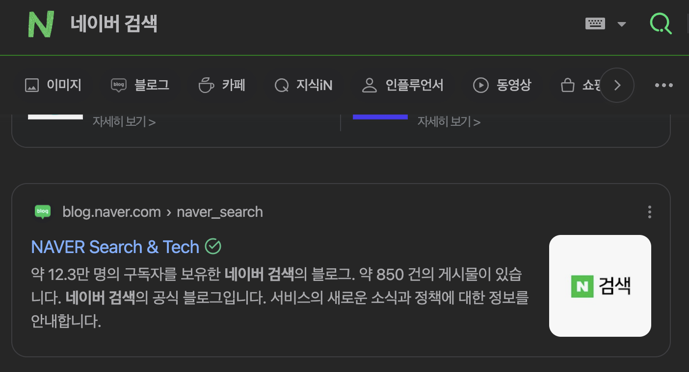

# 메타 태그

메타 태그(meta tag)에 대해서 생소할 수 있으나, 웹 또는 앱을 사용하면서 많이 이용해왔었다.

웹을 배울 때, `HTML`의 기본 구조에서 `<head> 섹션`에 위치하게 된다.

```html
<!--HTML의 head 태그 안에 위치하는 meta tag 예시-->

<!DOCTYPE html>
<html lang="en">
<head>

  <!--  메타 태그 들-->
  <meta charset="UTF-8">
  <meta name="viewport" content="width=device-width, initial-scale=1.0">
  <meta name="description" content="이 페이지는 메타 태그를 설명합니다.">

  <title>예제 페이지</title>
</head>
<body>
<h1>메타 태그에 대해 알아보자</h1>
</body>
</html>
```

이러한 메타 태그는 검색엔진과 웹 서비스, SNS 서비스에 프로젝트의 `주요 정보(메타 데이터)를 전달`하는 역할을 한다. 이를 통해 `검색 엔진 최적화(SEO)`를 지원한다.

<br/>
<br/>

## 1. 메타 태그 사용 예시

주변에서 흔하게 메타 태그를 사용한 예시를 찾아볼 수 있다.

<br/>

1. SNS 공유

<p align="center">
    <br/>
    <span>카카오 공유 시, 메타태그 이용</span>
</p>

<br/>

2. 검색 결과

<p align="center">
    <br/>
    <span>네이버 검색 시, 메타태그 이용</span>
</p>

<br/>
<br/>

## 2. Gatsby 메타 데이터

Gatsby에서도 검색 엔진 최적화(SEO)를 위해 메타 데이터를 적용할 수 있다.

<br/>

### 2-1. siteMetadata

해당 메타 데이터는 Gatsby 설정 파일인 `gatsby-config.js`에서 작성되며, `사이트 전체`에 걸쳐 사용하는 공통 메타 데이터를 정의하는데 사용된다.

즉, 블로그 제목, 기본 설명 등 페이지 별로 변하지 않는 정보를 설정하는데 이용된다.

<br/>

```js
// gatsby-config.js

// 기본적인 siteMetadata 적용
module.exports = {
  siteMetadata: {
    title: `Using Gatsby Head`,
    description: `Example project for the Gatsby Head API`,
    twitterUsername: `@gatsbyjs`,
    image: `/gatsby-icon.png`,
    siteUrl: `https://www.yourdomain.tld`,
  },
}
```

<br/>

이렇게 설정한 메타 데이터는 페이지나 컴포넌트에서 `useStaticQuery` 훅을 통해 GraphQL로 쿼리할 수 있다.

```tsx
// useStaticQuery 사용 예시

const SEO = () => {
  const { site } = useStaticQuery(
    graphql`
      query {
        site {
          siteMetadata {
            title
            description
            author
          }
        }
      }
    `
  );
};
```

<br/>

### 2-2. gatsby-plugin-react-helmet

위에서 쿼리한 메타 데이터를 사용하거나, 페이지나 컴포넌트에서 동적으로 메타 태그를 설정할 경우, `gatsby-plugin-react-helmet` 플러그인을 사용한다.

<br/>

1. 플러그인 설치

```bash
$ npm install gatsby-plugin-react-helmet react-helmet
```

<br/>

2. gatsby-config.js 파일에 등록하기

```js
// gatsby-config.js

{
  plugins: [`gatsby-plugin-react-helmet`]
}
```

<br/>

3. 쿼리한 메타 데이터 Helmet 태그와 사용하기

```tsx
// Helmet 태그 사용 예시

import React from 'react';
import { useStaticQuery, graphql } from 'gatsby';
import { Helmet } from 'react-helmet';

const SEO = () => {
  const { site } = useStaticQuery(
    graphql`
      query {
        site {
          siteMetadata {
            title
            description
            author
          }
        }
      }
    `
  );

  const { title, description, author } = site.siteMetadata;

  return (
    <Helmet>
      <meta charSet="utf-8" />
      <title>{title}</title>
      <meta name="description" content={description} />
      <meta name="author" content={author} />
      <link rel="canonical" href="http://mysite.com/example" />
    </Helmet>
  );
};

export default SEO;
```

<br/>

4. 페이지에서 사용하기

```tsx
import React from 'react';
import SEO from './SEO';

const MyPage = () => {
  return (
    <div>
      <SEO />
      <h1>마이 페이지</h1>
      <p>메타 데이터를 가지고 온 페이지입니다.</p>
    </div>
  );
};

export default MyPage;
```

<br/>

5. 커스텀한 메타 데이터 사용하기

useStaticQuery로 siteMetadata를 쿼리하고 props로 title, description 메타 데이터를 받기

```tsx
import React from 'react';
import { useStaticQuery, graphql } from 'gatsby';
import { Helmet } from 'react-helmet';

// props로 title, description 받기
const SEO = ({ title, description }) => {

  // gatsby-config.js의 siteMetadata 쿼리
  const { site } = useStaticQuery(
    graphql`
      query {
        site {
          siteMetadata {
            title
            description
            author
          }
        }
      }
    `
  );

  // 쿼리한 데이터를 기본 메타 데이터로 설졍
  const defaultTitle = site.siteMetadata.title;
  const defaultDescription = site.siteMetadata.description;
  const author = site.siteMetadata.author;

  return (
    <Helmet>
      <meta charSet="utf-8" />

      {/*props로 받은 메타 데이터가 있으면 props로 설정하고 없으면 쿼리한 메타 데이터로 넣기*/}
      <title>{title ? `${title} | ${defaultTitle}` : defaultTitle}</title>
      <meta name="description" content={description || defaultDescription} />
      <meta name="author" content={author} />
      <link rel="canonical" href="http://mysite.com/example" />
    </Helmet>
  );
};

export default SEO;
```

```tsx
// SEO 컴포넌트에 커스텀할 메타 데이터 props로 전달하기

import React from 'react';
import SEO from './SEO';

const MyPage = () => {
  return (
    <div>
      <SEO title="Custom Title" description="Custom description" />
      <h1>마이 페이지</h1>
      <p>커스텀 메타 데이터를 가지고 온 페이지입니다.</p>
    </div>
  );
};

export default MyPage;
```

<br/>
<br/>

## 3. 메타 데이터 속성과 종류

각각의 플랫폼과 서비스마다 사용하는 메타 태그의 속성에 차이가 있다. 해당 속성과 역할은 공식 문서에서 확인할 수 있으며, 종류가 매우 많다.

모든 속성을 다 사용할 필요는 없고 필요한 속성만 선별적으로 사용한다.

```tsx
// 다양한 메타 데이터 예시

<Helmet>
  <title>{title}</title>

  {/*기본적인 메타 데이터*/}
  <meta name="description" content={description} />
  <meta name="viewport" content="width=device-width, initial-scale=1.0" />
  <meta httpEquiv="Content-Type" content="text/html;charset=UTF-8" />

  {/*오픈 그래프 메타 데이터 - 페이스북에서 개발*/}
  <meta property="og:type" content="website" />
  <meta property="og:title" content={title} />
  <meta property="og:description" content={description} />
  <meta property="og:image" content={image} />
  <meta property="og:url" content={url} />
  <meta property="og:site_name" content={title} />

  {/*트위터 메타 데이터*/}
  <meta name="twitter:card" content="summary" />
  <meta name="twitter:title" content={title} />
  <meta name="twitter:description" content={description} />
  <meta name="twitter:image" content={image} />
  <meta name="twitter:site" content="@사용자이름" />
  <meta name="twitter:creator" content="@사용자이름" />

  <html lang="ko" />
</Helmet>
```

<br/>
<br/>

---

## Sources

### - Gatsby 공식문서 : Adding an SEO Component

https://www.gatsbyjs.com/docs/how-to/adding-common-features/adding-seo-component/

### - Gatsby 공식문서 : Adding Page Metadata

https://v3.gatsbyjs.com/docs/add-page-metadata/

### - The Open Graph protocol

https://ogp.me/

### - X Developer Platform : Cards

https://developer.x.com/en/docs/twitter-for-websites/cards/guides/getting-started

### - JeonggonCho_Blog 템플릿 레포지토리

https://github.com/JeonggonCho/JeonggonCho_Blog