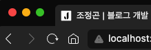

# favicon

파비콘(favicon)이란 favorite icon의 줄임말로서 웹사이트에서 사용되는 `대표 아이콘 이미지`이다. 주로 브라우저의 탭이나 즐겨찾기 아이콘으로 표시된다.

<br/>

<p align="center">
    <br/>
    <span>내 블로그의 favicon</span>
</p>

<br/>

파비콘은 사용자에게 사이트 탐색 시, 시각적인 요소를 제공하여 `사용자 경험을 향상` 시키고, 검색 엔진의 경우, `검색 결과에 파비콘을 노출`시켜 검색 엔진 최적화에 간접적으로
영향을 미친다.

<br/>
<br/>

## 1. favicon 출력방법

### 1-1. gatsby-plugin-manifest

해당 라이브러리는 `PWA(Progressive Web App, 모바일에서 웹을 앱처럼 사용할 수 있게 하는 기술)`를 지원하기 위해 필요한 `manifest.webmanifest` 파일을 생성한다.

이 파일에는 프로젝트의 이름, 아이콘, 색상, URL 등의 메타 데이터를 포함한다.

해당 이미지가 파비콘의 역할을 하며, 앱 설치나 북마크, 탭 아이콘으로 사용된다.

<br/>

1. 라이브러리 설치하기

```bash
$ npm install gatsby-plugin-manifest
```

<br/>

2. gatsby-config.js 파일에서 설정하기

```js
// gatsby-config.js

module.exports = {
  plugins: [
    {
      resolve: `gatsby-plugin-manifest`,
      options: {
        name: `프로젝트 이름`,
        start_url: `/`,
        background_color: `#ffffff`,
        display: `standalone`,
        icon: './static/favicon.png',
      },
    },
  ],
}
```

<br/>
<br/>

---

## Sources

### - Gatsby 공식문서 : gatsby-plugin-manifest

https://www.gatsbyjs.com/plugins/gatsby-plugin-manifest/

### - Gatsby 공식문서 : gatsby-plugin-favicons

https://www.gatsbyjs.com/plugins/gatsby-plugin-favicons/

### - JeonggonCho_Blog 템플릿 레포지토리

https://github.com/JeonggonCho/JeonggonCho_Blog