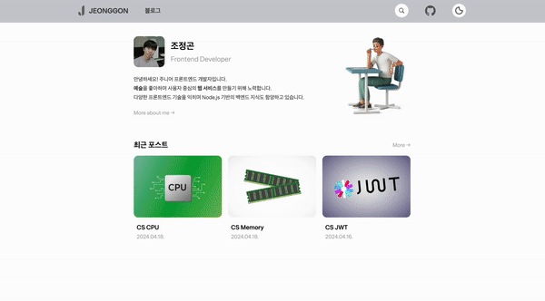
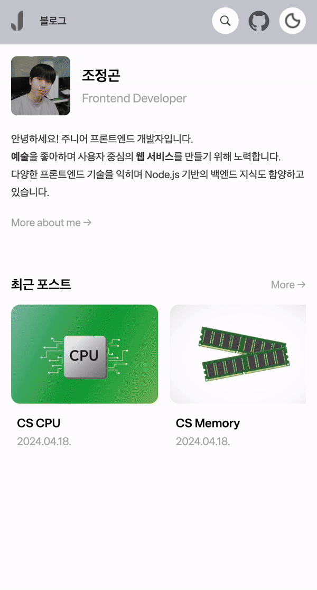

# 검색 기능 구현하기

Gatsby를 이용하여 블로그를 개발하면서 검색 기능은 방대한 블로그의 컨텐츠에서 `필요한 내용을 손쉽게 찾을 수 있어야` 하기에 `필수적인 기능`이라고 생각되었다.

<br/>

## 🔍 검색 기능 만들어보자

### 1. 검색 컴포넌트 생성

먼저 UI를 생각해보면, 검색 기능은 사용자 관점에서 `언제나 접근가능한 기능`이여야 한다. 따라서 모든 페이지에 `공통 레이아웃인 Template`의 `header`에 `Search 컴포넌트`를
생성하였다.

```tsx
// 초기 Search 컴포넌트 생성

const Search = () => {
  const [query, setQuery] = useState<string>('');

  const handleSearchBar = (e: ChangeEvent<HTMLInputElement>) => {
    e.preventDefault();
    setQuery(e.target.value);
  };

  return (
    <div>
      <input
        type="text"
        value={query}
        onChange={handleSearchBar}
        placeholder="Search..."
        id="search"
      />
    </div>
  );
};

export default Search;
```

<br/>

### 2. GraphQL로 모든 글 쿼리

useStaticQuery 훅을 통해 graphql 쿼리문을 작성한다. 쿼리한 데이터는 data 객체에 저장되고 객체는 블로그 글의 slug, 제목, 생성일, 태그, 썸네일 정보를 포함한다.

```tsx
// Search 컴포넌트 쿼리문 작성

const Search = () => {

  // ...

  const data = useStaticQuery(graphql`
      query getAllMarkdownRemark {
          allMarkdownRemark(sort: {order:DESC, fields: [frontmatter___date, frontmatter___title]}) {
              edges {
                  node {
                      id
                      fields {
                          slug
                      }
                      frontmatter {
                          title
                          date(formatString: "YYYY.MM.DD.")
                          tags
                          thumbnail {
                              childImageSharp {
                                  gatsbyImageData(width: 300, height: 140)
                              }
                          }
                      }
                  }
              }
          }
      }
  `);

  // ...

};
```

<br/>

### 3. 필터링하기

해당 data 객체에서 검색 시, 필터링에 사용될 정보는 제목과 태그들이다.

검색 시, 띄워쓰기(공백)은 무시되도록하고, 대소문자 구분이 없도록 모두 소문자화한다.

```tsx
// Search 컴포넌트 

const Search = () => {

  // ...

  // 앞서 data 객체에서 edges 가져와 posts에 저장
  const posts = data.allMarkdownRemark.edges

  // posts 순회하면서 필터링하기
  const filteredPosts: PostType[] = posts.filter((post: PostType) => {

    // frontmatter에서 필터링에 사용할 title과 tags를 구조분해할당으로 가져오기
    const { title, tags } = post.node.frontmatter

    // 태그들의 문자열을 모두 소문자로 바꾸고, 정규표현식을 사용해 모든 띄워쓰기 없애기
    const lowerTags = tags.map((tag: string) => tag.toLowerCase().replace(/ /g, ''))

    // 검색 input에 들어간 query 문자열 역시 소문자로 바꾸고, 띄워쓰기 없앤 뒤, 태그들에서 query 문자열과 같은 tag 필터링하기
    const tagsQuery = lowerTags.includes(query.toLowerCase().replace(/ /g, ''))

    // 제목 title도 소문자로 바꾸고, 띄워쓰기 없앤 뒤, 검색어로 필터링하기
    const titleQuery = title.toLowerCase().replace(/ /g, '').includes(query.toLowerCase().replace(/ /g, ''))

    return (
      // 필터링된 제목이나 태그가 있고, 검색 input에 공백없이 검색 문자열이 있으면 해당 필터링 결과를 리턴하기
      (titleQuery || tagsQuery) && query.replace(/ /g, '').length !== 0
    )
  });

  // ...

};
```

<br/>

### 4. 필터링된 검색결과 출력하기

```tsx
// Search 검색 결과 출력

const Search = () => {

  return (
    <div>

      {/*...*/}

      {/*위에서 필터링되어 리턴된 posts 순회하기*/}
      <p>검색 결과는 <b>{filteredPosts.length}</b> 개 입니다</p>
      <div>
        {filteredPosts.map(({ node }, index) => (

          // 클릭 시, 해당 글 페이지로 이동
          <NavLink key={index} to={node.fields.slug}>
            {/*썸네일 이미지*/}
            <figure>
              <GatsbyImage
                alt="thumbnail"
                image={node.frontmatter.thumbnail.childImageSharp.gatsbyImageData}
                css={searchResultThumbnailStyle}
              />
            </figure>
            {/*제목과 작성일*/}
            <div>
              <span>{node.frontmatter.title}</span>
              <span>{node.frontmatter.date}</span>
            </div>
          </NavLink>
        ))}
      </div>

      {/*...*/}

    </div>
  );
};

export default Search;
```

<br/>
<br/>

## 검색 기능 구현 결과

Emotion.js의 Styled Component로 스타일링까지 적용하여 검색 기능을 최종적으로 구현한 모습은 아래와 같다.

<br/>

<p align="center">
    <br/>
    <span>웹 화면 검색 기능</span>
</p>

<br/>

<p align="center">
    <br/>
    <span>모바일 화면 검색 기능</span>
</p>

<br/>
<br/>

---

## Sources

### - JeonggonCho_Blog 템플릿 레포지토리

https://github.com/JeonggonCho/JeonggonCho_Blog