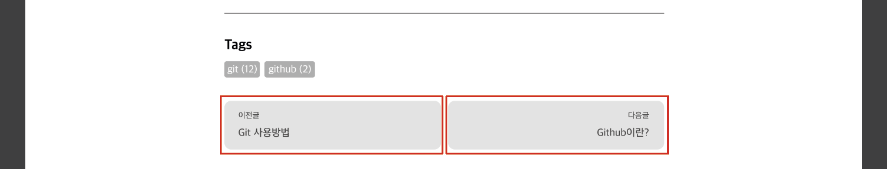
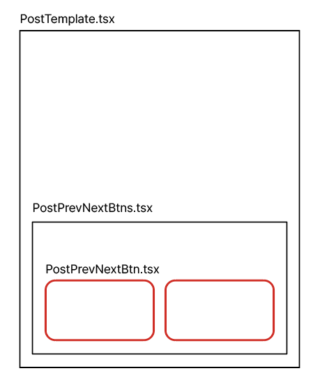
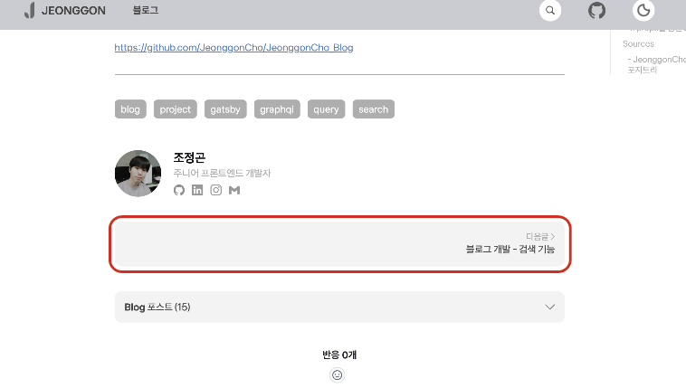
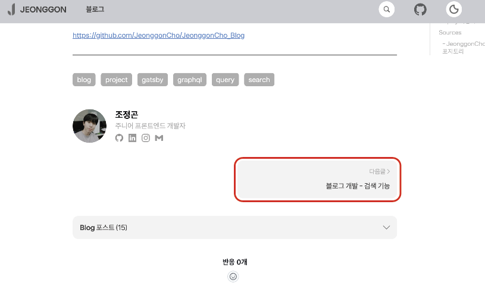

# display: none과 visibility: hidden 차이 (feat. 다음, 이전 버튼)

포스트 페이지의 하단에 다음글, 이전글로 이동할 수 있는 버튼을 만들고 싶었고 디자인은 아래와 같이 설정하였다.

<br/>

<p align="center">
    <br/>
    <span>포스트 페이지 하단의 이전버튼, 다음버튼 figma 디자인</span>
</p>

<br/>

## 🕹️ 버튼 구현하기

### 1. 페이지 생성 시, gatsby-node.js

```js
// gatsby-node.js

exports.createPages = async ({ actions, graphql, reporter }) => {
  const { createPage } = actions

  const queryAllMarkdownData = await graphql(
    `
          {
              allMarkdownRemark(
                  sort: {
                      order:DESC
                      fields: [frontmatter___date, frontmatter___title]
                  }
              ) {
                  edges {
                      node {
                          id
                          fields {
                              slug
                          }
                      }
                  }
              }
          }
    `
  )

  if (queryAllMarkdownData.errors) {
    reporter.panicOnBuild(`Error while running query`)
    return
  }

  const posts = queryAllMarkdownData.data.allMarkdownRemark.edges

  posts.forEach((post, index) => {

    // 이전 포스트와 다음 포스트의 id
    const prevPostId = index === 0 ? null : posts[index - 1].node.id
    const nextPostId = index === posts.length - 1 ? null : posts[index + 1].node.id

    // 페이지 생성 시, 이전 포스트와 다음 포스트의 id 담아서 생성하기
    createPage({
      path: post.node.fields.slug,
      component: path.resolve(__dirname, "src/templates/PostTemplate.tsx"),
      context: {
        slug: post.node.fields.slug,
        prevPostId,
        nextPostId
      }
    })
  })
}
```

<br/>

### 2. 이전글, 다음글에 대한 정보 쿼리하기

```tsx
// PostTemplate에서 쿼리하기

// ...

export const queryMarkdownDataSlug = graphql`
    query queryMarkdownDataBySlug($slug: String, $prevPostId: String, $nextPostId: String) {
        site {
            siteMetadata {
                author
            }
        }
        allMarkdownRemark(filter: {fields: {slug: {eq: $slug}}}) {
            edges {
                node {
                    html
                    frontmatter {
                        title
                        date(formatString: "YYYY.MM.DD.")
                        tags
                        category
                        thumbnail {
                            childImageSharp {
                                gatsbyImageData
                            }
                            publicURL
                        }
                    }
                }
            }
        }
        
        // gatsby-node.js에서 받은 prevPostId와 같은 id의 slug와 title을 받아 previous로 props 전달
        previous: markdownRemark(id: {eq: $prevPostId}) {
            fields {
                slug
            }
            frontmatter {
                title
            }
        }
        
        // gatsby-node.js에서 받은 nextPostId와 같은 id의 slug와 title을 받아 next로 props 전달
        next: markdownRemark(id: {eq: $nextPostId}) {
            fields {
                slug
            }
            frontmatter {
                title
            }
        }
    }
`;
```

<br/>

### 3. 컴포넌트 간 구조

<p align="center">
    <br/>
    <span>각 컴포넌트 간의 구조</span>
</p>

<br/>

### 4. props를 통한 조건부 렌더링

PostTemplate 컴포넌트에서 쿼리한

```tsx
// PostTemplate.tsx

import PostPrevNextBtns from "components/Blog/Post/PostPrevNextBtns";

const PostTemplate = ({ next, previous }) => {
  return (
    <div>
      <PostPrevNextBtns
        previous={previous}
        next={next}
      />
    </div>
  );
};

export default PostTemplate;

export const queryMarkdownDataSlug = graphql`
  // ...
  previous: ...
  next: ...
`;
```

<br/>

```tsx
// PostPrevNextBtns.tsx

import PostPrevNextBtn from "components/Blog/Post/PostPrevNextBtn";

const PostPrevNextBtns = () => {
  return (
    <div>
      <PostPrevNextBtn
        label="< 이전글"
        slug={prevSlug}
        title={prevTitle}
      />
      <PostPrevNextBtn
        label="다음글 >"
        slug={nextSlug}
        title={nextTitle}
      />
    </div>
  );
};

export default PostPrevNextBtns;
```

<br/>

```tsx
// PostPrevNextBtn.tsx

import styled from "@emotion/styled";
import { Link } from "gatsby";

const PostPrevNextBtnWrapper = styled(Link)<({ label: string, slug: string })>`

    // slug가 없을 경우 (가장 맨 앞 포스트로서 이전글이 없음, 가장 맨 뒤 포스트로서 다음글이 없음)
    // display: none
    // slug가 있을 경우
    // display: block
    
    display: ${({ slug }) => slug === "" ? "none" : "block"};
    
    gap: 12px;
    width: 100%;
    height: auto;
    padding: 16px;
    background-color: ${({ theme }) => theme.colors.background.prevNext};
    border-radius: 12px;
    transition: all 0.1s linear;
    text-align: ${({ label }) => label === "다음글 >" ? "right" : "left"};

    &:hover {
        background-color: ${({ theme }) => theme.colors.background.button};
    }
`;

const PostPrevNextBtn = ({ label, slug, title }) => {
  return (
    <PostPrevNextBtnWrapper
      to={slug}
      label={label}
      slug={slug}
    >
      <label>{label}</label>
      <p>{title}</p>
    </PostPrevNextBtnWrapper>
  );
};

export default PostPrevNextBtn;
```

<br/>

## display 속성과 visibility 속성 비교

이렇게 `PostPrevNextBtnWrapper`에 Styled Component의 props로 전달받은 `slug` 값의 따라서 `display` 속성을 `none` 또는 `block`으로 조건부 렌더링을 처음에
처리했었다.

하지만 이렇게 display로 처리하면 가장 맨 앞 포스트, 맨 뒤 포스트에서 버튼이 하나만 있을 때, 아래의 이미지와 같이 하나의 버튼으로 너비가 가득 차버리게 되었다.

<br/>

<p align="center">
    <br/>
    <span>display: none으로 처리한 버튼의 모습</span>
</p>

<br/>

하나의 버튼만 있을 경우, 하나의 버튼이 너비를 가득 채우지 않도록 하기위해 `display` 대신 `visibility` 속성을 도입하였다.

<br/>

```tsx
// PostPrevNextBtn.tsx

import styled from "@emotion/styled";
import { Link } from "gatsby";

const PostPrevNextBtnWrapper = styled(Link)<({ label: string, slug: string })>`
    display: flex;
    
    // slug가 없을 경우 (가장 맨 앞 포스트로서 이전글이 없음, 가장 맨 뒤 포스트로서 다음글이 없음)
    // visibility: hidden
    // slug가 있을 경우
    // visibility: visible
    
    visibility: ${({ slug }) => slug === "" ? "hidden" : "visible"};
    
    flex-direction: column;
    gap: 12px;
    width: 100%;
    height: auto;
    padding: 16px;
    background-color: ${({ theme }) => theme.colors.background.prevNext};
    border-radius: 12px;
    transition: all 0.1s linear;
    text-align: ${({ label }) => label === "다음글 >" ? "right" : "left"};

    &:hover {
        background-color: ${({ theme }) => theme.colors.background.button};
    }
`;

// ...
```

<br/>

<p align="center">
    <br/>
    <span>visibility: hidden으로 처리한 버튼의 모습</span>
</p>

<br/>

### 1. 정리

| 속성   | display          | visibility              |
|------|------------------|-------------------------|
| 기능   | 요소를 화면에서 완전히 제거  | 요소를 보이지 않게 하지만 화면에 남아있음 |
| 레이아웃 | 요소가 문서 흐름에서 사라짐  | 요소는 여전히 문서의 흐름에 남아있음    |
| 공간차지 | 요소가 차지하는 공간이 사라짐 | 요소가 차지하는 공간은 그대로 유지됨    |

<br/>
<br/>

---

## Sources

### - mdn 공식문서 : visibility

https://developer.mozilla.org/ko/docs/Web/CSS/visibility

### - JeonggonCho_Blog 템플릿 레포지토리

https://github.com/JeonggonCho/JeonggonCho_Blog