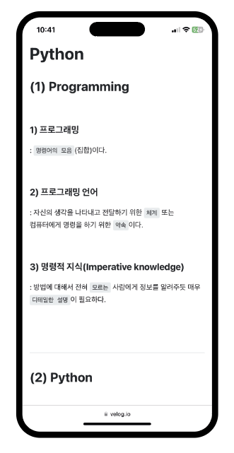

# Gatsby에 TOC 도입하기

블로그 글의 `목차`를 정렬해 놓은 것을 `TOC (Table Of Contents)`라고 한다. 짧은 블로그 글의 경우, 내용을 빠르게 파악할 수 있지만, 상대적으로 긴 블로그 글은 어떤 내용이 있는지 알기 어렵고
찾기도 쉽지 않다. 따라서 블로그에서 TOC 구현은 유저의 편의성을 위해 필수적이라고 생각되어 도입하였다.

<br/>

## TOC 사례

벨로그, 티스토리 등의 플랫폼에서 TOC를 사용한 것을 볼 수 있다. 주로 사이드에 `sticky`나 `fixed`의 속성으로 위치한다.

<br/>

<p align="center">
    <br/>
    <span>벨로그의 TOC</span>
</p>

<br/>

하지만 모바일 환경에서는 포스트 상단에 고정되어 지속적으로 TOC를 확인하기 어렵다. 하지만 나는 작은 화면의 모바일 환경에서도 손쉽게 접근할 TOC가 필요하다고 생각되었다.

<br/>

| 화면 상단에 TOC가 고정됨                                   | 본문에서는 접근 할 수 없음                                   |
|---------------------------------------------------|---------------------------------------------------|
|  |  |

<br/>

## 블로그 TOC UI 설정하기

따라서 `웹 환경`에서의 TOC는 벨로그와 같이 `사이드`에 배치하고 `모바일 환경`에서는 아이폰의 `다이나믹 아일랜드`와 같은 형상으로 디자인하여 필요 시, `드롭다운`으로 접근할 수 있도록 했다.

<br/>

<p align="center">
    <br/>
    <span>웹 TOC 디자인</span>
</p>

<br/>

<p align="center">
    <br/>
    <span>모바일 TOC 디자인</span>
</p>

<br/>

## Gatsby에서 TOC 구현하기

### 1. 라이브러리 설치하기

gatsby-transformer-remark 플러그인을 사용하여 마크다운 파일을 처리하고 `gatsby-remark-autolink-headers` 플러그인을 사용하여 제목 (#, ##, ###, ...)에
자동으로 `id를 추가`한다. 나중에 TOC 생성 후, 해당 id를 통해 `링크`하게 된다.

```bash
$ npm install gatsby-remark-autolink-headers
```

<br/>

### 2. gatsby-config.js 설정하기

gatsby-transformer-remark에 옵션으로 플러그인 gatsby-remark-autolink-headers를 넣는다.

```js
// gatsby-config.js

module.exports = {
  plugins: [
    {
      resolve: `gatsby-transformer-remark`,
      options: {
        plugins: [
          {
            resolve: `gatsby-remark-autolink-headers`,
            options: {
              // 옵션 필요 시, 추가
            }
          }
        ],
      },
    },
  ],
}
```

<br/>

### 3. TOC 쿼리하기

markdownRemark는 gatsby-transformer-remark 플러그인을 통해 생성된 GraphQL 노드타입이다.

마크다운 파일 중 변수 $slug와 같은 fields.slug값의 마크다운 파일을 필터링한다.

해당 파일에서 tableOfContents를 가져오며, 이 객체에는 파일의 목차 (h 태그) 데이터가 담겨있다.

`heading` 옵션은 `특정한 헤딩부터 TOC를 생성`할 수 있도록 하며 빈문자열("")은 전체 헤딩을 포함한다.

`maxDepth` 옵션은 TOC에 포함할 `최대 헤딩의 깊이`를 의미하며 3일 경우, h3까지 TOC에 포함한다.

```tsx
// TOC 데이터 쿼리하기

export const queryMarkdownDataSlug = graphql`
    query queryMarkdownDataBySlug($slug: String) {
        getToc: markdownRemark(fields: {slug: {eq: $slug}}) {
            tableOfContents(heading: "", maxDepth:3)
        }
    }
`
```

<br/>

### 4. 출력하기

마크다운 본문 출력과 동일하게 `dangerouslySetInnerHTML` 속성을 이용한다.

아래와 같이 dangerouslySetInnerHTML 속성의 `__html`에 쿼리한 `tableOfContents`를 전달하면 TOC를 출력할 수 있다.

```tsx
// TOC 출력 컴포넌트 PostToc.tsx 간단한 예시

const PostToc = ({
                   data: {
                     getToc
                   }
                 }) => {
  return (
    <div dangerouslySetInnerHTML={{ __html: getToc.tableOfContents }} />
  );
};

export default PostToc;
```

<br/>

`웹` 환경에서 보여질 TOC 컴포넌트인 `PostToc.tsx` 와 `모바일` 환경에서 보여질 TOC 컴포넌트인 `PostMobileToc.tsx`를 따로 제작하여 media query를 통해 환경에 따라서
조건부로 렌더링 되도록 처리하였다.

<br/>
<br/>

## 최종 구현 TOC 모습

Styled Component를 통해 스타일링을 완료한 TOC는 아래의 이미지와 같다.

<br/>

<p align="center">
    <br/>
    <span>웹 용 TOC</span>
</p>

<br/>

<p align="center">
    <br/>
    <span>모바일 용 TOC</span>
</p>

<br/>
<br/>

---

## Sources

### - Apple : 아이폰 다이나믹 아일랜드

https://support.apple.com/ko-kr/guide/iphone/iph28f50d10d/ios

### - Gatsby 공식문서 : gatsby-transformer-remark

https://www.gatsbyjs.com/plugins/gatsby-transformer-remark/

https://www.gatsbyjs.com/plugins/gatsby-transformer-remark/#getting-table-of-contents

### - Gatsby 공식문서 : gatsby-remark-autolink-headers

https://www.gatsbyjs.com/plugins/gatsby-remark-autolink-headers/

### - JeonggonCho_Blog 템플릿 레포지토리

https://github.com/JeonggonCho/JeonggonCho_Blog