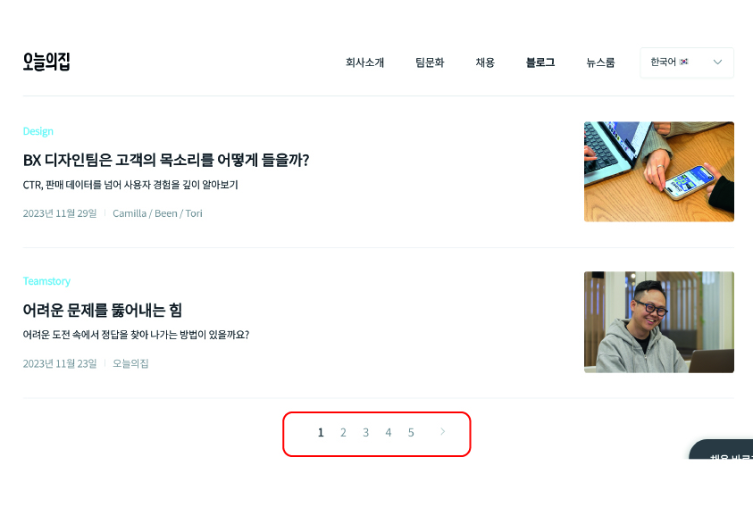

# 페이지네이션 구현하기

여러 블로그 사이트에서 포스트들의 리스트를 제공하는 방법을 살펴보면 크게 두 가지 방법으로 구현되어있다.

<br/>

## 1. 무한스크롤 (Infinity Scroll)

브라우저의 스크롤을 일정 구간 내려가게 되면 사이트에서는 추가로 포스트를 쿼리하여 계속해서 렌더링을 해주는 방식이 무한스크롤이다.

<br/>
<table>
    <tr>
        <td width="50%"><br/></td>
        <td width="50%"><br/><br/></td>
    </tr>
    <tr>
        <td align="center"><a href="https://velog.io/" target="_blank">Velog</a></td>
        <td align="center"><a href="https://medium.com/zigbang" target="_blank">직방 기술블로그</a></td>
    </tr>
</table>

<br/>
<br/>

## 2. 페이지네이션 (Pagination)

페이지네이션은 각 페이지마다 페이지를 구별하는 번호가 있고 해당 번호를 호출 시, 번호에 해당하는 블로그 글들을 보여주는 방식이다.

<br/>

<table>
    <tr>
        <td width="50%"></td>
        <td width="50%"></td>
    </tr>
    <tr >
        <td align="center"><a href="https://blog.banksalad.com/tech/" target="_blank">뱅크샐러드 기술블로그</a></td>
        <td align="center"><a href="https://www.bucketplace.com/culture/" target="_blank">오늘의집 기술블로그</a></td>
    </tr>
    <tr>
        <td></td>
        <td></td>
    </tr>
    <tr>
        <td align="center"><a href="https://techblog.lycorp.co.jp/ko" target="_blank">라인 기술블로그</a></td>
        <td align="center"><a href="https://techblog.woowahan.com/" target="_blank">우아한 기술블로그</a></td>
    </tr>
    <tr>
        <td></td>
        <td></td>
    </tr>
    <tr>
        <td align="center"><a href="https://tech.kakao.com/blog/" target="_blank">카카오 기술블로그</a></td>
        <td align="center"><a href="https://blog.hwahae.co.kr/category/all/tech" target="_blank">화해 기술블로그</a></td>
    </tr>
</table>

<br/>
<br/>

## 3. 비교

두 방식 모두, 포스트 목록을 보여주는 효과적인 방법이며, 각각 장단점이 있다고 보여진다. 두 방식을 비교해보면, `무한 스크롤`의 경우, 스크롤만으로 포스트를 탐색할 수 있기에 사용자 경험이 편하며,
끊김없이 포스트를 볼 수 있는 장점이 있다. 하지만, 특정한 포스트를 찾는 것과 뒤로가기를 했을 경우, 이전 영역으로 돌아가는 것에 어려움이 있다. `페이지네이션`의 경우는 포스트가 일정 개수로 분할되어 체계적이고
원하는 영역으로 바로 이동할 수 있어 탐색에 용이하나 사용자 경험이 연속적이지 못하다. 어쩌면 서로의 장단점이 반대라고 보여진다.

<br/>

내 생각에는 SNS 피드나, 최신의 컨텐츠를 우선적으로 제공하는 것이 중요한 매체의 경우에는 `무한 스크롤`을 사용하는 것이 적절하며, 특정 정보를 탐색해야하거나 게시물을 좀 더 체계적으로 제공해야하는
블로그에는 `페이지네이션`을 적용하는 것이 사용자에게 유리할 것이라고 판단되어 나의 블로그에는 페이지네이션을 구현하여 포스트 목록을 보여주기로 하였다.


<br/>

추가로 같은 페이지네이션이지만 위의 예시에서 볼 수 있듯이 약간의 차이가 있었다. 뱅크샐러드 기술블로그의 경우, 페이지네이션이지만 이전, 다음 버튼만으로 구성되어있었기에 원하는 번호의 페이지로 이동하기 위해서는 다음
버튼을 여러 번 눌러야 한다. 이러한 구조는 블로그의 글이 적으면 괜찮지만 많아질 경우, 불편할 수 있다. 오늘의집, 라인의 기술블로그는 페이지 번호와 이전, 다음 버튼을 제공하지만 맨 앞, 맨 뒤로 이동하는 버튼은
제공하지 않고 있었다. 이 역시, 블로그 글이 많아질 경우, 불편할 수 있다. 우아한 기술블로그, 카카오 기술블로그, 화해 기술블로그의 경우, 맨 앞, 맨 뒤로 이동할 수 있는 버튼을 제공하고 있었다. 나 역시
탐색의 용이성을 위해 `페이지 번호`, `다음, 이전 버튼`, `맨 앞, 맨 뒤 버튼`을 모두 제공하기로 하였다.

<br/>
<br/>

## 4. 페이지네이션 구현

- 페이지네이션을 위한 로직은 usePagination 커스텀 훅을 통해 생성하며, 각 컴포넌트의 구조는 아래의 이미지와 같이 구성하였다.

<br/>

<p align="center">
   <br/>
   <span>컴포넌트 구성</span>
</p>

<br/>
<br/>

### 4-1. usePagination

1. 페이지네이션을 위한 커스텀 훅 생성하기

    - usePagination 함수는 `totalItems (전체 포스트 개수)`와 끊어서 보여줄 `itemsPerPage (페이지 당 포스트 단위 개수)` 2가지를 인자로 받는다.
    - 2가지 요소를 리턴하는데 하나는 `numPages (총 페이지 개수)` 값과 `getPageItems (페이지의 포스트들을 반환하는 함수)`이다.
        - numPages는 usePagination이 받은 totalItems를 itemsPerPage로 나누고 올림한 값이다. useMemo()로 값을 최적화하기
        - getPageItems는 `currentPage (현재 페이지 번호)`와 `items (전체 포스트 배열)`를 인자로 받아 현재 페이지에 포함되는 포스트들을 반환한다.
        - getPageItems에서 `start`값은 현재 페이지에 포함되는 포스트 중 `첫번째 포스트의 인덱스`이며, `end`값은 현재 페이지에 포함되는 포스트 중 `마지막 포스트 인덱스`이다.
        - items에서 start와 end 인덱스 사이의 항목을 slice를 통해 잘라서 반환한다.

```ts
// usePagination.ts

import { useMemo } from "react"

const usePagination = (totalItems: number, itemsPerPage: number) => {
  const numPages = useMemo(() => Math.ceil(totalItems / itemsPerPage), [totalItems, itemsPerPage]);

  const getPageItems = (currentPage: number, items: any[]) => {
    const start = (currentPage - 1) * itemsPerPage;
    const end = start + itemsPerPage;
    return items.slice(start, end);
  }

  return { numPages, getPageItems };
}

export default usePagination;
```

<br/>
<br/>

### 4-2. Posts

1. 메타 데이터(siteMetadata), 모든 포스트 목록 배열(edges), 썸네일(publicURL) 등을 GraphQL을 이용하여 쿼리하기

```tsx
// posts.tsx

// ...

export const getPostList = graphql`
    query getPostList {
        site {
            siteMetadata {
                title
                description
                siteUrl
            }
        }
        allMarkdownRemark(
            sort: {order:DESC, fields: [frontmatter___date, frontmatter___title]}
        ) {
            edges {
                node {
                    id
                    fields {
                        slug
                    }
                    frontmatter {
                        title
                        date(formatString: "YYYY.MM.DD.")
                        tags
                        thumbnail {
                            childImageSharp {
                                gatsbyImageData(width: 300, height: 140)
                            }
                        }
                    }
                }
            }
        }
        file(name: {eq: "meta-thumbnail"}) {
            publicURL
        }
    }
`
```

<br/>

2. 쿼리한 데이터를 props로 받고, `query-string`라이브러리의 queryString.parse 함수를 통해 props로 전달받은 search(쿼리 문자열)를 객체로 만들어 parsed에 할당하기

    - 예를들어, URL이 `https://example.com/posts?page=2` 과 같다면, search는 `search = "?page=2"` 문자열이고 queryString.parse를 통해 생성한
      객체 parsed는 `parsed = {page : "2"}`와 같다.

```tsx
// posts.tsx

//...
import queryString, { ParsedQuery } from "query-string";

const postsPage: FC<postsPageProps> = ({
                                         location: { search },
                                         data: {
                                           site: {
                                             siteMetadata: { title, description, siteUrl }
                                           },
                                           allMarkdownRemark: { edges },
                                           file: { publicURL }
                                         }
                                       }) => {

  const parsed: ParsedQuery<string> = queryString.parse(search);

  //...
}
```

<br/>

3. 페이지네이션 설정을 위해 usePagination 커스텀 훅 사용하기

    - 전체 포스트 수 (edges.length)와 끊어서 보여줄 포스트 개수(원하는 단위 개수)를 usePagination에 인자로 주어 numPages, getPageItems 반환받기
    - 현재 페이지 번호 (currentPage)는 앞서 생성한 parsed 객체에서 page 키의 값을 할당하며, 없을 경우에는 1을 기본 값으로 하기
    - getPageItems에 현재 페이지 번호 (currentPage)와 전체 포스트 배열 (edges)을 전달하여 현재 페이지의 포스트 목록 (currentPosts) 배열 받기
    - 현재 페이지의 포스트 목록 (currentPosts)과 현재 페이지 번호 (currentPage), 총 페이지 개수 (numPages)를 PostList 컴포넌트에 props로 전달하기

```tsx
// posts.tsx

// ...

const { numPages, getPageItems } = usePagination(edges.length, 6);
const currentPage = parseInt(parsed.page as string, 10) || 1;
const currentPosts = getPageItems(currentPage, edges);

return (
  //...
  <PostList
    edges={currentPosts}
    currentPage={currentPage}
    numPages={numPages}
  />
);

// ...
```

<br/>
<br/>

### 4-3. PostList

- props로 전달받은 edges, currentPage, numPages에서 edges는 PostCards의 props로 currentPage, numPages는 PostPagination의 props로 전달하기

```tsx
// PostList.tsx

// ...

const PostList = ({ edges, currentPage, numPages }) => {
  return (
    <>
      <PostCards edges={edges} />
      {edges.length !== 0 && <PostPagination currentPage={currentPage} numPages={numPages} />}
    </>
  );
};

export default PostList;
```

<br/>
<br/>

### 4-4. PostCards

- 배열 메서드 `map`을 통해 순회하여 각각의 포스트들을 렌더링한다.
- 전달받은 포스트 배열 (edges)가 없을 경우, 게시물 없음 메시지를 출력한다.

```tsx
// PostCards.tsx

// ...

const PostCards = ({ edges }) => {
  return (
    <>
      {edges.length !== 0 ? edges.map((el) => (
          <PostCard
            key={el.node.id}
            title={el.node.frontmatter.title}
            date={el.node.frontmatter.date}
            tags={el.node.frontmatter.tags}
            image={el.node.frontmatter.thumbnail.childImageSharp.gatsbyImageData}
            slug={el.node.fields.slug}
          />
        ))
        :
        <div>게시물이 없어요</div>
      }
    </>
  )
};

export default PostCards;
```

<br/>
<br/>

### 4-5. PostPagination

- 해당 컴포넌트는 페이지네이션의 실질적인 컴포넌트로 각 `페이지의 번호`, `다음, 이전 버튼`, `맨 앞, 맨 뒤 버튼`을 가지고 있다.
- 컴포넌트는 props로 `현재 페이지 번호 (currentPage)`값과 `모든 페이지 번호 (numPages)` 값을 받는다.

```tsx
// PostPagination.tsx

// React 컴포넌트와 필요한 라이브러리들 import
import React from "react";
import { Link } from "gatsby";

// PostPagination 컴포넌트 정의
const PostPagination = ({ currentPage, numPages }) => {

  // 초기 변수 할당
  const isFirst = currentPage === 1; // 현재 페이지가 1페이지인지 여부를 나타내는 boolean 값
  const isLast = currentPage === numPages; // 현재 페이지가 마지막 페이지인지 여부를 나타내는 boolean 값
  const prevPage = currentPage - 1 === 1 ? "1" : (currentPage - 1).toString(); // 이전 페이지 번호
  const nextPage = (currentPage + 1).toString(); // 다음 페이지 번호
  const pagesToShow = 5; // 페이지네이션에 보여질 페이지 번호 개수
  let startPage = 1; // 첫 페이지 번호 초기값
  let endPage = numPages; // 마지막 페이지 번호 초기값

  // 전체 페이지 수가 보여질 페이지 번호 개수보다 큰 경우
  if (numPages > pagesToShow) {
    // 현재 페이지가 페이지네이션의 첫 부분에 가까운 경우
    if (currentPage <= Math.floor(pagesToShow / 2) + 1) {
      startPage = 1; // 시작 페이지는 1
      endPage = pagesToShow; // 끝 페이지는 보여질 페이지 번호 개수
    }
    // 현재 페이지가 페이지네이션의 마지막 부분에 가까운 경우
    else if (currentPage >= numPages - Math.floor(pagesToShow / 2)) {
      startPage = numPages - pagesToShow + 1; // 시작 페이지는 끝 페이지에서 보여질 페이지 번호 개수를 뺀 값
      endPage = numPages; // 끝 페이지는 전체 페이지 수
    }
    // 현재 페이지가 페이지네이션의 중간 부분에 있는 경우
    else {
      startPage = currentPage - Math.floor(pagesToShow / 2); // 시작 페이지는 현재 페이지에서 보여질 페이지 번호 개수의 절반을 뺀 값
      endPage = currentPage + Math.floor(pagesToShow / 2); // 끝 페이지는 현재 페이지에서 보여질 페이지 번호 개수의 절반을 더한 값
    }
  }

  return (
    <>
      {/* 첫 페이지가 아닌 경우 첫 페이지와 이전 페이지로 이동하는 링크 표시 */}
      {!isFirst && (
        <>
          <Link to={`/posts/?tag=${selectedTag}&page=1`}>〈〈</Link>
          <Link to={`/posts/?tag=${selectedTag}&page=${prevPage}`}>〈</Link>
        </>
      )}

      {/* 페이지 번호 목록을 배열로 생성하여 각각의 페이지 링크를 생성 */}
      {Array.from({ length: endPage - startPage + 1 }, (_, i) => {
        const pageNumber = startPage + i; // 현재 페이지 번호
        const isCurrentPageNumber = currentPage === pageNumber; // 현재 페이지인지 여부
        return (
          <div
            key={`pagination-number${pageNumber}`}
            isCurrentPageNumber={isCurrentPageNumber} // 현재 페이지인지 여부를 속성으로 설정
          >
            <Link to={`/posts/?tag=${selectedTag}&page=${pageNumber}`}>{pageNumber}</Link> {/* 페이지 링크 */}
          </div>
        );
      })}

      {/* 마지막 페이지가 아닌 경우 다음 페이지와 마지막 페이지로 이동하는 링크 표시 */}
      {!isLast && (
        <>
          <Link to={`/posts/?tag=${selectedTag}&page=${nextPage}`}>〉</Link>
          <Link to={`/posts/?tag=${selectedTag}&page=${numPages}`}>〉〉</Link>
        </>
      )}
    </>
  );
};

export default PostPagination;
```

<br/>
<br/>

## 5. 페이지네이션 구현 결과

<p align="center">
   <br/>
   <span>페이지네이션이 적용된 블로그 포스트 목록</span>
</p>

<br/>
<br/>

---

## Sources

### - JeonggonCho_Blog 템플릿 레포지토리

https://github.com/JeonggonCho/JeonggonCho_Blog