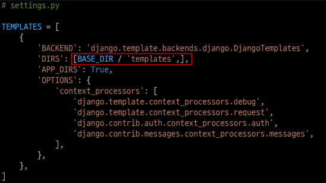
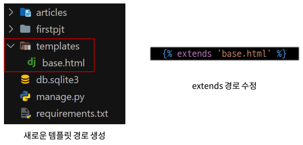

# Django Template

## 1. Template System

- 데이터 표현을 제어하면서, 표현과 관련된 로직을 담당

<br>

### 1-1. Django Template Language(DTL)

- Template에서 조건, 반복, 변수, 필터 등의 `프로그래밍적 기능을 제공`하는 시스템

<br>

### 1-2. DTL Syntax

### - Variable

- view 함수에서 `render 함수`의 `3번째 인자`로 `딕셔너리 타입`으로 넘겨 받을 수 있음
- 딕셔너리 key에 해당하는 문자열이 template에서 사용 가능한 변수명이 됨
- 점(.)표기법을 사용하여 변수 속성에 접근 가능

```python
# view 함수
def index(request):
    context = {
        'name': '조정곤',
    }
    # render 함수의 3번째 인자(context 딕셔너리)에 담아 템플릿으로 보냄
    return render(request, 'articles/index.html', context)
```

```html

<body>
<h1>Hello, {{ name }}</h1>
</body>
```

- 중괄호 두 개 `{{ variable }}` 사용

<br>

### - Filters

- 표시할 변수를 `수정`할 때 사용
- chained가 가능하며, 일부 필터는 인자를 받기도 함
- 약 60개 정도의 내장 템플릿 필터(built-in template filters)를 제공
- Django 공식 사이트
  제공 : [내장 템플릿 필터 목록](https://docs.djangoproject.com/en/5.0/ref/templates/builtins/#built-in-filter-reference)

```html
<!--필터 예시-->
<h1>{{ text|truncatewords:3 }}</h1>

<!--truncatewords는 앞에서 지정한 개수의 단어만 표시하고 뒤는 (...)으로 처리-->
<!--즉 변수 text가 'My name is Jeonggon.'이면 위의 예시 필터를 적용하면 'My name is...'으로 표기됨-->
```

- 기존 변수 표기법에서 수직바(|)를 사용하고 그 뒤에 필터문 작성 `{{ variable|filter }}`

<br>

### - Tags

- `반복` 또는 `논리`를 수행하여 `제어의 흐름`을 만드는 등 변수보다 복잡한 작업을 수행
- 일부 태그는 시작과 `종료`태그가 필요
    - ex) ` `
- 약 24개의 내장 템플릿 태그(built-in template tags)를 제공
- Django 공식 사이트
  제공 : [내장 템플릿 태그 목록](https://docs.djangoproject.com/en/5.0/ref/templates/builtins/#built-in-tag-reference)

```html
<!--태그 예시-->
<!--반복문 태그 for-->
 There is a point at {{ x }},{{ y }} 
```

- %를 사용 ``

<br>

### - Comments

- DTL에서 주석을 표시

```html
<!--특정 일부 변수를 주석 처리할 경우-->
<h1>Hello, {# name #}</h1>

<!--여러 줄을 주석 처리할 경우-->
   
```

- 특정 일부 변수의 경우 `{# 변수명 #}`을 사용
- 여러 줄일 경우 `주석 처리 영역`를 사용

<br>

### 1-3. DTL 예시

```python
# urls.py

# url 요청들이 담긴 리스트 urlpatterns
urlpatterns = [
    path('admin/', admin.site.urls),
    path('articles/', views.index),

    # dinner/ 주소로 요청을 보내면 path 함수를 통해 dinner/ 주소를 받아 views.py의 dinner 함수를 실행
    path('dinner/', views.dinner),
]
```

```python
# views.py

import random


# views.dinner 요청으로 dinner 함수 실행
def dinner(request):
    # 음식 종류 리스트
    foods = ['족발', '햄버거', '치킨', '초밥']

    # 음식 종류 중 랜덤으로 선택된 것 picked에 할당
    picked = random.choice(foods)

    # context 딕셔너리에 데이터 담기
    context = {
        'foods': foods,
        'picked': picked,
    }
    # articles 앱의 템플릿 중 dinner.html에 context 데이터를 보내 렌더링하기
    return render(request, 'articles/dinner.html', context)
```

```html
<!--articles/dinner.html-->

<p>{{ picked }} 메뉴는 {{ picked|length }}글자 입니다.</p>

<h2>메뉴판</h2>
<ul>
  
  <li>{{ food }}</li>
  
</ul>


<p>메뉴가 소진되었습니다.</p>

<p>아직 메뉴가 남았습니다.</p>

```

<p align="center">
  <br/>
  <span>DTL 예시 결과</span>
</p>

<br>
<br>

## 2. 템플릿 상속(Template inheritance)

- 페이지의 `공통요소를 포함`하고, 하위 템플릿이 `재정의 할 수 있는 공간을 정의`하는 기본 `스켈레톤(skeleton = 뼈대)` 템플릿을 작성하여 상속
- 예를 들어 웹 페이지의 head, navbar, footer 등은 `공통 레이아웃`이므로 모든 템플릿에서 중복해서 작성하는 것은 `비효율적`임

<p align="center">
  <br/>
  <span>유튜브 웹 페이지의 콩통요소 - head</span>
</p>

<br/>

- 또한 동일한 `프레임워크, 라이브러리, CDN` 등을 모든 템플릿에 적용해야 할 경우에도 중복해서 작성하는 것이 아닌 `템플릿 상속`을 통해 효율적으로 적용 가능

```html
<!--articles/base.html-->

<! DOCTYPE html>
<html lang="en">
<head>
  ...
</head>
<!--공통요소 부분-->

<!--재정의 할 수 있는 공간 지정-->
 
</html>
```

```html
<!--다른 html 파일-->

 
<h1>Hello {{ name }}</h1>

```

- 재정의 할 공간을 ``을 통해 베이스 HTML 파일에 지정
- 베이스 HTML을 사용할 다른 HTML 파일에서는 ``를 사용해서 가져옴
- 그 이후 재정의 공간과 같이 ` 추가할 코드 작성 ` 태그 내부에 코드를 독립적으로 작성

<br>

### 2-1. 'extends' tag

```html

```

- 자식(하위) 템플릿이 부모 템플릿을 확장(가져옴)한다는 것을 알림
- 반드시 템플릿의 `최상단`에 작성되어야 함
- 2개 이상 사용 불가능 함

<br>

### 2-2. 'block' tag

```html

```

- 하위 템플릿에서 재정의(overridden)할 수 있는 블록을 정의(하위 템플릿이 작성할 수 있는 공간 지정)

<br>
<br>

## 3. 요청과 응답 - form

### 3-1. 데이터 보내고 가져오기

- HTML의 `form 요소`를 통해 사용자와 애플리케이션 간의 `상호작용` 하기

<br>

### - 'form' element

- 사용자로부터 할당된 데이터를 서버로 전송
- 웹에서 사용자 정보를 입력하는 여러 방식(text, password 등)을 제공

<br>

### - 'action' & 'method'

- form의 핵심 속성 2가지
- 데이터를 어디(action)로 어떤 방식(method)으로 보낼 지 지정

- action

    - 입력된 데이터가 전송될 `URL`을 지정(`목적지`)
    - 속성을 지정하지 않으면, 현재 form이 있는 페이지의 URL로 보냄

- method
    - 데이터를 `어떤 방식`으로 보낼 것인지 정의
    - 데이터의 `HTTP request methods(GET, POST)`를 지정

```html
<!--form(action & method) 사용 예시-->

<form action="#" method="GET">
  <div>
    <lable for="name">아이디 :</lable>
    <input type="text" id="name" />
  </div>
  <div>
    <label for="password">패스워드 : </label>
    <input type="password" name="password" id="password" />
  </div>
  <input type="submit" value="로그인" />
</form>
```

<p align="center">
  <br/>
  <span>form 요소 사용 예시 결과</span>
</p>

<br>

### - 'input' element

- 사용자의 데이터를 입력 받을 수 있는 요소
- type 속성 값에 따라 다양한 유형의 입력 데이터를 받음

<p align="center">
  <br/>
  <span>input 요소의 type 종류</span>
</p>

<br>

### - 'name' 속성

- input의 핵심 속성
- 데이터를 제출했을 경우, `서버`는 name 속성에 설정된 값을 통해 `사용자가 입력한 데이터에 접근` 가능

<p align="center">
  <br/>
  <span>Django 입력 제출 시, url의 구조</span>
</p>

<br/>

- url의 물음표(?) 뒤에 `name 속성`에 입력 값을 담아 `url로 전달`하게 됨(`Query String Parameters`)

<br>

### - Query String Parameters

- 사용자의 입력 데이터를 URL 주소에 파라미터를 통해 넘겨주는 방법
- 문자열은 앰퍼샌드(&)로 연결된 key=value 쌍으로 구성
- 물음표(?)로 구분됨

```
http://host:port/path?key=value&key=value
```

<br>
<br>

## 4. 요청과 응답 예시

### 4-1. 입력을 받아 그대로 출력

### - 입력 받는 기능

```python
# urls.py

urlpatterns = [
    path('throw/', views.throw),
]
```

- 해당 url 요청 시, views.py의 throw 함수가 실행

```python
# views.py

def throw(request):
    return render(request, 'articles/throw.html')
```

- throw 함수는 요청을 받아 throw.html 파일을 렌더링함

```html
<h1>입력</h1>
<form action="/catch/" method="GET">
  <input type="text" id="message" name="message" />
  <input type="submit" />
</form>
```

- throw.html 파일은 다음과 같이 입력과 제출 버튼으로 구성
- 따라서 입력 창에 입력하고 제출 버튼 클릭 시, form 태그의 action 속성의 해당 url로 `message=입력한 내용`을 담아 전달

<br>

### - 출력 기능

```python
# urls.py

urlpatterns = [
    path('catch/', views.catch),
]
```

- 전달된 url의 경로를 받아 views.py의 catch 함수가 실행

```python
# views.py

def catch(request):
    message = request.GET.get('message')
    context = {
        'message': message,
    }
    return render(request, 'articles/catch.html', context)
```

- 전달받은 데이터는 `HTTP request 객체`로 view 함수의 첫번째 인자인 `request`에 담겨있음
- 딕셔너리의 `.get()` 메서드를 통해 값에 접근하고 이 값을 context에 담아 렌더링될 catch.html 템플릿으로 전달

<p align="center">
  <br/>
  <span>Django request 출력해보기</span>
</p>

<br/>

<p align="center">
  <br/>
  <span>request 객체에서 get 메서드를 통해 값 조회</span>
</p>

<br/>

```html
<h1>출력</h1>
<h3>{{ message }}를 출력합니다.</h3>
```

- 전달받은 context 객체에서 변수 message를 이용해 출력

<br>
<br>

## 5. 참고

### 5-1. 템플릿 경로 지정





<br>

### - BASE_DIR

- settings에서 경로지정을 편하게 하기 위해 `최상단 지점을 지정`해놓은 변수

```python
# settings.py

BASE_DIR = Path(__file__).resolve().parent.parent
```

<br>

### 5-2. DTL 주의사항

- Python처럼 일부 프로그래밍 구조(if, for 등)를 사용할 수 있지만 명칭이 동일하게 설계되어있을 뿐 `Python과 관련 없음`
- 프로그래밍적 로직이 아닌 단지 템플릿을 가공하여 `렌더링하기 위한 목적`임
- 따라서 프로그래밍적 로직은 views.py 함수(서버)에서 작성 및 처리하도록 함

[//]: # (---)

[//]: # ()

[//]: # (## Source)

[//]: # ()

[//]: # (- [<>]&#40;<>&#41;)

