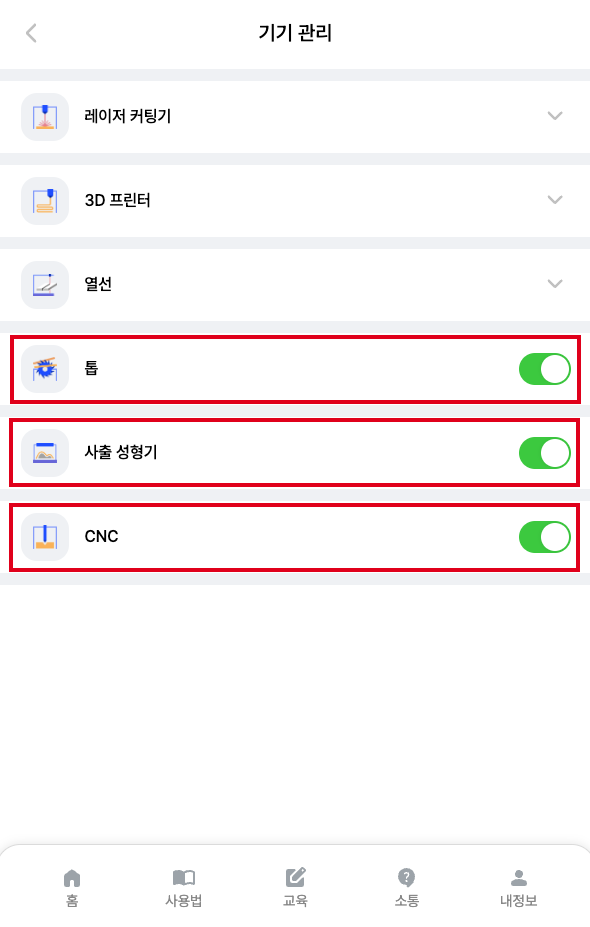
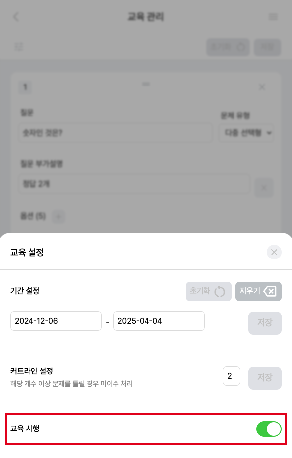
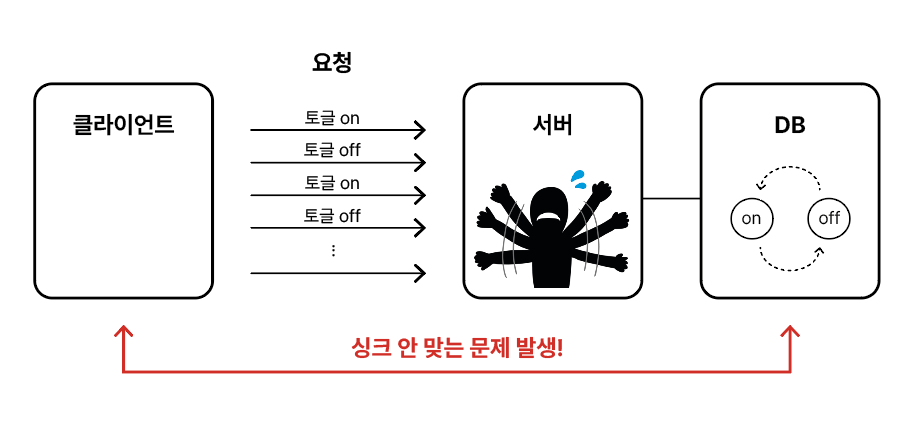

## 토글 버튼

프로젝트를 진행하면서 관리자 관련 페이지를 만들 경우에 많이 사용한 컴포넌트가 `토글` 컴포넌트이다.

아래와 같이 기기 이용을 제어하거나, 이벤트를 열기 닫기 등 무엇인가를 `ON / OFF` 해야하는 경우에 토글 컴포넌트를 사용함으로써 직관적으로 상태를 확인할 수 있는 동시에 제어하기에도 용이하다.

| 기기 관리 화면                                                    | 교육 관리 화면                                                      |
|-------------------------------------------------------------|---------------------------------------------------------------|
|  |  |

<br/>

따라서 초기 토글 컴포넌트를 다음 코드를 통해 작성하였다.

```tsx
// 초기 Toggle 컴포넌트

import { FC, useCallback, useState } from "react";
import { IToggleProps } from "@/types/componentProps.ts";
import { Container } from "./style.ts";
import useRequest from "@hooks/useRequest.ts";

const Toggle: FC<IToggleProps> = ({ url, status }) => {
  const [toggleValue, setToggleValue] = useState<boolean>(status);

  const { sendRequest } = useRequest();

  const handleToggle = useCallback(async () => {
    setToggleValue((prevState) => !prevState);
    await sendRequest({
      url: url,
      method: "patch",
      data: { status: !toggleValue },
    });
  }, [url]);

  return (
    <>
      <Container
        onClick={handleToggle}
        toggleValue={toggleValue}
      >
        <div />
      </Container>
    </>
  );
};

export default Toggle;
```

코드를 간단히 설명하면

1) 토글 컴포넌트는 토글을 제어하는 url과 초기 상태값 status를 props로 받음
2) useState로 토글 상태 관리
3) handToggle은 토글 클릭 시, 동작하는 onClick 동작 함수로 ```Optimistic Updates(낙관적 업데이트)```를 적용하여 클릭하면 현재 토글 상태를 반전시키고 서버에 해당 반전된 상태로
   DB를 수정하도록 요청을 보내도록 함

> 여기서 잠깐!
>
> <h3>Optimistic Updates(낙관적 업데이트)란?</h3>
>
> 낙관적 업데이트는 애플리케이션에서 사용자 경험을 높이기 위해 적용하는 개념으로 서버로 보내는 요청이 정상적일 것이라고 예상하고 실제 서버에 데이터가 반영되기 전에 `미리 클라이언트의 UI나 상태를 업데이트`
> 시키는
> 것을 의미한다.

초기에는 위의 코드가 큰 문제가 없는 것으로 보였으나 QA를 진행하며 문제 상황이 발생하였다.

<br/>

## 문제상황

낙관적 업데이트가 일단 클라이언트 상에서 UI를 변경하기에 빠르게 동작하여 UX적으로 유리하나, 서버 상황을 고려하지 않기에 문제가 발생할 수 있다.

클라이언트의 요청에서 문제가 있거나 서버에서 요청을 처리하다가 문제가 발생하는 경우, <b>클라이언트의 상태와 서버의 상태에서 싱크가 안 맞아 오차가 발생</b>할 수 있다.

<br/>

### 스스로 문제 상황 만들어 보기

<p align="center">
<br/>
<span>토글 !!!!!</span>
</p>

유저들은 순순히 우리의 의도대로 서비스를 이용하지 않는다. 나 역시, 토글을 연속해서 클릭을 해보고, 브라우저를 새로고침을 해보았다.

이렇게 해보니 몇몇 경우에 ```토글이 ON 상태(클라이언트 상태)였는데 새로고침하니 OFF 상태(DB 상태)로 바뀌는 현상```이 발생했다.

<p align="center">

</p>

<br/>

## 싱크 오차를 해결하기 위한 방법으로는?

### 1. Optimistic Updates 사용하지 않기 (X)

클라이언트 상에서 미리 UI 상태를 변경하지 않고, 서버를 통해 DB의 데이터를 변경하고 비동기 요청이 성공한 경우에만 클라이언트의 UI를 변경하는 것이다.

해당 방법의 코드는 다음과 같다.

```tsx
// 낙관적 업데이트를 사용하지 않은 Toggle 컴포넌트

import { FC, useCallback, useState } from "react";
import { IToggleProps } from "@/types/componentProps.ts";
import { Container } from "./style.ts";
import useRequest from "@hooks/useRequest.ts";

const Toggle: FC<IToggleProps> = ({ url, status }) => {
  const [toggleValue, setToggleValue] = useState<boolean>(status);
  const [isLoading, setIsLoading] = useState<boolean>(false);  // 비동기 요청 중 여부

  const { sendRequest } = useRequest();

  const handleToggle = useCallback(async () => {
    if (isLoading) return;  // 이미 요청 중이면 클릭 무시
    setIsLoading(true);  // 비동기 요청 시작

    try {
      await sendRequest({
        url: url,
        method: "patch",
        data: { status: !toggleValue },
      });
      // 요청 성공 시 토글 상태 업데이트
      setToggleValue((prevState) => !prevState);
    } catch (err) {
      console.error("Toggle failed", err);
    } finally {
      setIsLoading(false);  // 요청 완료 후 다시 활성화
    }
  }, [url, toggleValue, isLoading, sendRequest]);

  return (
    <>
      <Container
        onClick={handleToggle}
        toggleValue={toggleValue}
        disabled={isLoading}  // 비동기 요청 중이면 클릭 비활성화
      >
        <div />
      </Container>
    </>
  );
};

export default Toggle;
```

useState 상태 관리에 `isLoading`을 추가하고 요청 중이면 isLoading 상태를 통해 토글 버튼을 비활성화하고 서버의 요청 성공 시, isLoading을 해제하도록 처리하였다.

이렇게 할 경우 요청 완료 전에는 토글 버튼이 비활성화되기 때문에 싱크 오차를 해결할 수 있으나 네트워크의 속도가 느리거나 서버에서 처리하는 속도가 느린 경우, 버퍼링으로 토글을 빠르게 ON / OFF 할 수 없는
문제가 발생한다.

<br/>

### 2. Optimistic Updates을 유지하며 개선하기 (feat. 롤백) (O)

그렇다면 어떻게 낙관적 업데이트를 유지하면서 싱크를 맞출 수 있게 할 수 있을까?

요청에서 에러가 발생하였을 경우, 토글 상태를 `롤백`을 시켜줌으로써 싱크 오차를 없애고 기존의 낙관적 업데이트의 빠른 UI 피드백 장점을 유지할 수 있다.

```tsx
// 낙관적 업데이트를 사용하며 롤백 기능으로 개선된 Toggle 컴포넌트

import { FC, useCallback, useState } from "react";
import { IToggleProps } from "@/types/componentProps.ts";
import { Container } from "./style.ts";
import useRequest from "@hooks/useRequest.ts";

const Toggle: FC<IToggleProps> = ({ url, status }) => {
  const [toggleValue, setToggleValue] = useState<boolean>(status);

  const { sendRequest } = useRequest();

  const handleToggle = useCallback(() => {
    setToggleValue(prevState => {
      const newState = !prevState;

      sendRequest({
        url: url,
        method: "patch",
        data: { status: newState },
      }).catch(err => {
        console.error("토글 에러 발생 :", err);

        // 문제가 발생할 경우, 롤백하기
        setToggleValue(currentState => (currentState === newState ? prevState : currentState));
      });

      return newState;
    });
  }, [url, sendRequest]);

  return (
    <>
      <Container
        onClick={handleToggle}
        toggleValue={toggleValue}
      >
        <div />
      </Container>
    </>
  );
};

export default Toggle;
```

사용자가 토글 버튼을 클릭하면 handleToggle()이 호출되며 내부에서 setToggleValue()가 실행된다.

여기서 기존 값(prevState)의 반대 값(newState)를 계산하여 return newState로 UI를 즉시 변경한다.

동시에 서버 요청을 실행하고 서버요청이 성공하면 그대로 유지하고 에러가 발생하여 실패하면 catch문이 실행된다.

에러가 발생하면 setToggleValue()를 통해 기존 값(prevState)로 롤백시켜야 하는데 이때 사용자가 다시 버튼을 연속해서 클릭하는 경우가 있을 수 있다. 현재 UI상태(currentState)가
요청을 보낼 때 설정한 값(newState)과 같은 경우에만 롤백을 하고 그렇지 않으면 사용자가 이미 상태를 변경했으므로 그대로 둔다.

<br/>

1. currentState === newState 인 경우
   : 사용자가 추가적인 클릭을 하지 않았으므로 롤백을 해야 함

2. currentState !== newState 인 경우
   : 사용자가 버튼을 다시 눌러서 상태가 이미 바뀌었으므로 롤백하면 안 됨

<br/>

이렇게 하면 낙관적 업데이트의 장점이 빠른 UI 피드백과 함께 에러 시에도 최신 상태를 유지 할 수 있다.

[//]: # (---)

[//]: # ()

[//]: # (## Source)

[//]: # ()

[//]: # (- [<>]&#40;<>&#41;)

