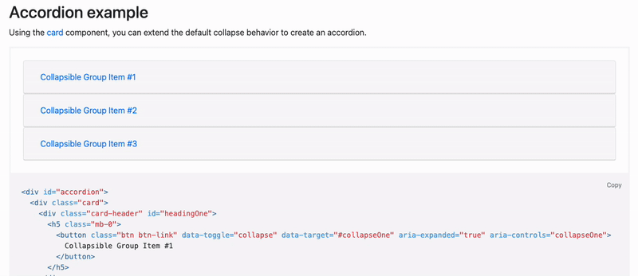

## List Collapse

List Collapse(= Multi Collapse, Collapse, Accordion)는 UI 컴포넌트 측면에서 리스트 요소나 메뉴를 동적으로 `접거나 축소`하여 가독성을 높이고 공간을 절약하는 기능을
의미합니다.

 

 
Bootstrap 아코디언 예시

[//]: # (---)

[//]: # ()

[//]: # (## Source)

[//]: # ()

[//]: # (- [<>]&#40;<>&#41;)
