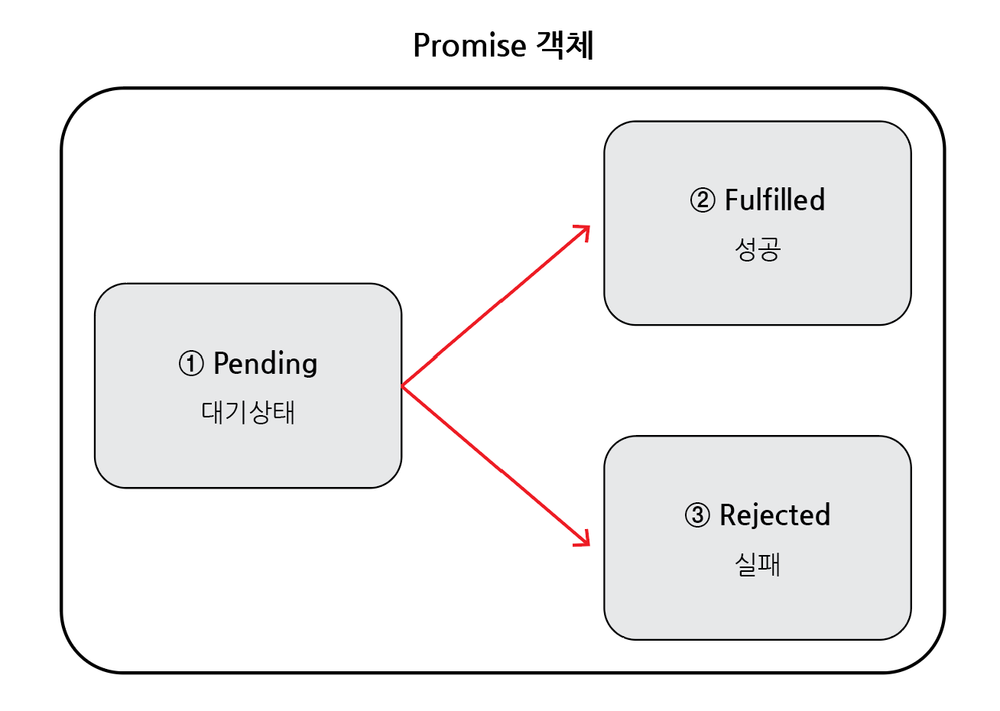

# Promise

## 1. 콜백지옥

- `연속되는 비동기 함수`에서 비동기 처리의 결과 값을 사용하기 위해 `콜백이 계속 깊어지는` 현상

```javascript
// ex) 콜백지옥 예시

step1(function(value1) {
  step2(function(value2) {
    step3(function(value3) {
      step4(function(value4) {
        console.log(value4);
      });
    });
  });
});
```

<br>
<br>

## 2. Promise란?

- JavaScript의 비동기 처리를 돕는 객체

<br>

### 2-1. 비동기 작업이 가지는 3가지 상태



1. `Pending` (대기상태) : 현재 비동기 작업이 진행 중이거나, 작업이 시작할 수 없는 문제가 발생한 상태

2. `Fulfilled` (성공) : 비동기 작업이 의도한 대로 정상적으로 수행됨

3. `Rejected` (실패) : 비동기 작업이 어떠한 이유로 실패함

- ex) 시간지연으로 인한 자동 취소 등...

<br>

### 2-2. Promise 사용 예시

```javascript
// 일반적인 비동기 함수 코드

function isPositive(number, resolve, reject) {
  setTimeout(() => {
    if (typeof number === "number") {
      // 성공 -> resolve
      resolve(number >= 0 ? "양수" : "음수");
    } else {
      // 실패 -> reject
      reject("주어진 값이 숫자형이 아닙니다.");
    }
  }, 2000);
}

isPositive(
  [],
  (res) => {
    console.log("성공적으로 수행됨 : ", res);
  },
  (err) => {
    console.log("실패 하였음 : ", err);
  }
);

// --------------------------------------------------

// Promise를 적용한 코드로 수정

function isPositive(number) {
  // 실행자
  const executor = (resolve, reject) => {
    setTimeout(() => {
      if (typeof number === "number") {
        // 성공 -> resolve
        console.log(number);
        resolve(number >= 0 ? "양수" : "음수");
      } else {
        // 실패 -> reject
        reject("주어진 값이 숫자형이 아닙니다.");
      }
    }, 2000);
  };

  const asyncTask = new Promise(executor);
  return ayncTask;
}

const res = isPositive([]);

res.then((res) => {
  console.log("성공적으로 수행됨 : ", res);
}).catch((err) => {
  console.log("실패 하였음 : ", err);
});
```

- 실행자 executor를 Promise 객체에 넣기

- 함수 isPositive()를 호출해서 리턴 값 Promise 객체를 res 변수에 담기

- then 메서드와 catch 메서드를 이용가능
    - `.then()` : resolve(성공) 시, 실행되는 메서드
    - `.catch()` : reject(실패) 시, 실행되는 메서드

<br>

### 2-3. Promise 사용하여 콜백지옥 탈출하기

```javascript
// 기존 콜백지옥(Callback Hell)

taskA(3, 4, (a_res) => {
  console.log("task A: ", a_res);
  taskB(a_res, (b_res) => {
    console.log("task B: ", b_res);
    taskC(b_res, (c_res) => {
      console.log("task C: ", c_res);
    });
  });
});
```

```javascript
// Promise 사용하여 콜백지옥 탈출

function taskA(a, b) {
  return new Promise((resolve, reject) => {
    setTimeout(() => {
      const res = a + b;
      resolve(res);
    }, 3000);
  });
}

function taskB(a) {
  return new Promise((resolve, reject) => {
    setTimeout(() => {
      const res = a * 2;
      resolve(res);
    }, 1000);
  });
}

function taskC(a) {
  return new Promise((resolve, reject) => {
    setTimeout(() => {
      const res = a * -1;
      resolve(res);
    }, 2000);
  });
}

taskA(5, 1) // Promise를 리턴
  .then((a_res) => {
    console.log("A RESULT: ", a_res);
    return taskB(a_res);
  }) // Promise를 리턴
  .then((b_res) => {
    console.log("B RESULT: ", b_res);
    return taskC(b_res);
  }) // Promise를 리턴
  .then((c_res) => {
    console.log("C RESULT: ", c_res);
  });
```

- `then 체이닝(Chaining)` : 연속된 then으로 Promise 객체를 계속 반환

<br>

<p align="center">
  <br/>
  <span>then 체이닝</span>
</p>

<br>
<br>

## 3. Promise 사용 이유

### 3-1. Promise 장점

- Promise 객체를 사용하면 then 체이닝을 통해 `아래로 늘여서` 작성가능하여 내부로 파고들게 작성하던 콜백지옥을 해결할 수 있음
- 또한 중간에 `다른 작업을 삽입`하는 것도 가능함

```javascript
// 다른 작업 삽입

const bPromiseResult = taskA(5, 1).then((a_res) => {
  console.log("A RESULT: ", a_res);
  return taskB(a_res);
});

// 중간에 코드 삽입
console.log("중간에 작업삽입");
console.log("중간에 작업삽입");
console.log("중간에 작업삽입");
console.log("중간에 작업삽입");
console.log("중간에 작업삽입");

// 다시 Promise 객체인 bPromiseResult를 사용하여 콜백사용
bPromiseResult
  .then((b_res) => {
    console.log("B RESULT: ", b_res);
    return taskC(b_res);
  })
  .then((c_res) => {
    console.log("C RESULT: ", c_res);
  });
```

[//]: # (---)

[//]: # ()

[//]: # (## Source)

[//]: # ()

[//]: # (- [<>]&#40;<>&#41;)

