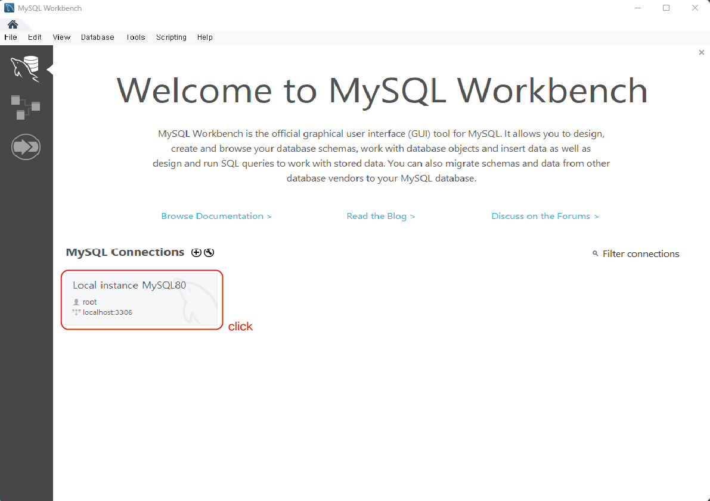
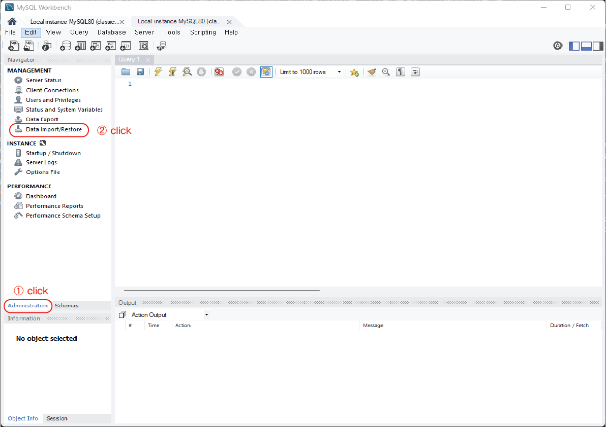
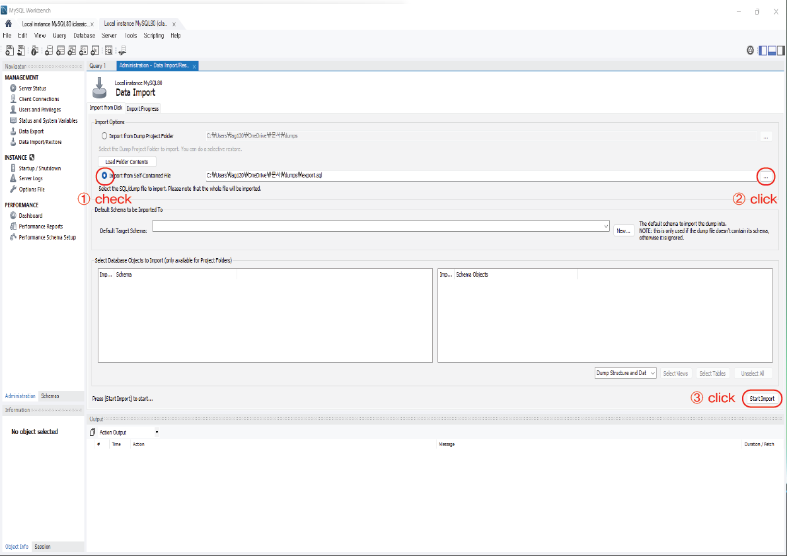
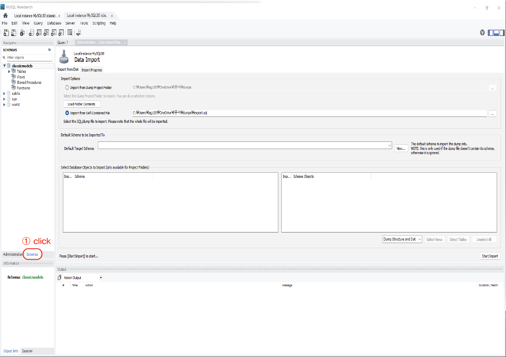
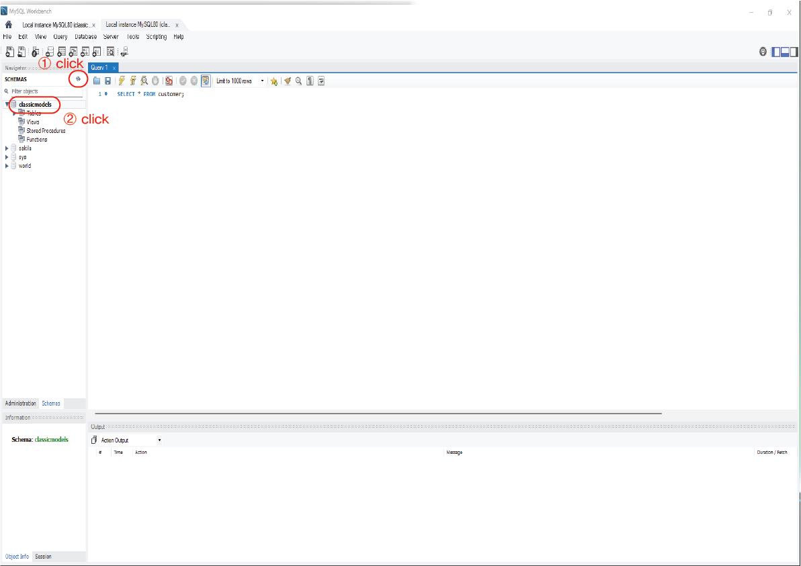
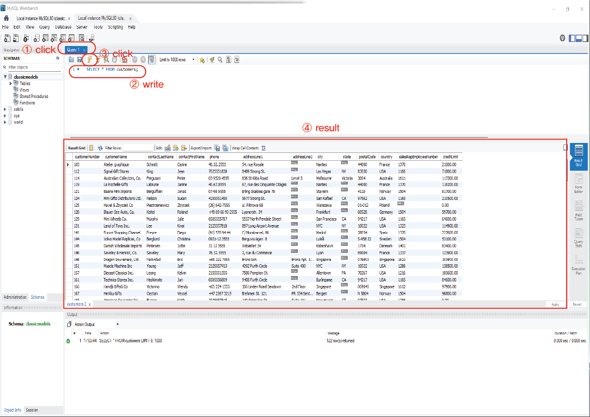

# MySQL_Workbench

## 1. Workbench 정의

- MySQL의 워크벤치는 아래의 이미지와 같이 SQL의 개발과 관리, DB설계, 생성 및 유지를 위한 단일 개발 통합 환경을 제공
- `비주얼 데이터베이스 설계 도구(GUI Tool)`이다.

<p align="center">
    <br/>
    <span>MySQL_Workbench</span>
</p>

<br>
<br>

## 2. MySQL_Workbench 설치

[MySQL\_다운로드링크](https://dev.mysql.com/downloads/installer/)

- `패스워드` 생성 및 `한글입력설정`

<br>
<br>

## 3. Workbench 활용 MySQL DB 접속 방법

### 3-1. MySQL 접속



<br>

### 3-2. 데이터 베이스 넣기

- 좌측 메뉴탭에서 `Administration` 클릭

    - `Data Import/Restore` 클릭
      

<br>

- `Import from Self - Contained File` 체크

    - 우측 `...` 클릭
    - 다운로드 받은 `sample_db.sql 파일` 선택
    - `Start Import`
      

<br>

- `Import Completed` 확인

<br>

### 3-3. 데이터 베이스 확인

- 좌측 메뉴탭에서 `schema` 클릭
    - `새로고침` 클릭
    - 데이터 베이스 `classicmodels` 확인
      
      

<br>
<br>

## 4. 데이터 베이스에 대한 쿼리(Query)문 작성 및 쿼리문 실행 방법

- 쿼리(Query) : 데이터 베이스에서 '특정 원하는 정보를 추출'하기 위해 요청하는 과정을 말한다.

ex) 브라우져 검색기능, 온라인 쇼핑몰 가격범위설정, 지도검색 등등

<br>

### 4-1. 쿼리문 작성

- 실습 데이터 베이스인 `classicmodels` 더블클릭

- 상단 탭의 `Query(쿼리에디터)` 클릭

- 입력창에 쿼리문 입력

```sql
예시

SELECT *
FROM customers;
```

<br>

### 4-2. 쿼리문 실행

- `번개 아이콘`을 클릭하여 쿼리 실행

- 하단 테이블 뷰어를 통해 출력된 `데이터 확인`하기
  

[//]: # (---)

[//]: # ()

[//]: # (## Source)

[//]: # ()

[//]: # (- [<>]&#40;<>&#41;)

