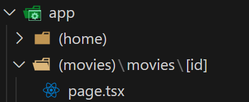
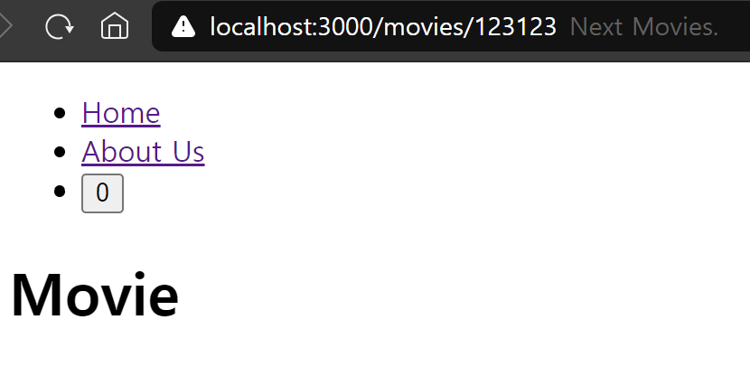
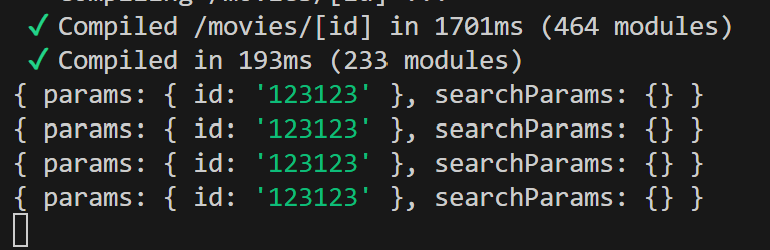
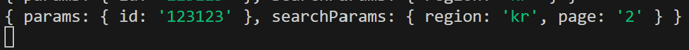
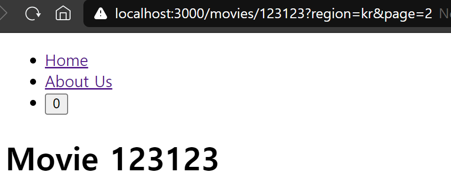

# Dynamic Routes

## 1. Static route

- 기존의 `home/about-us`와 같은 url은 정적 route임
- 동일한 페이지를 출력함

<br>
<br>

## 2. Dynamic route

- `home/movies/123123`과 같이 사용자의 입력, 문자열, 숫자를 포함하는 url을 동적 route라고 함
- url의 정보에 따라 동일한 페이지에 다른 정보를 담아서 출력함
- React의 react-route에서 사용한 `/movies/:id`와 동일한 기능
- Next.js에서는 파일시스템(파일 + 폴더)를 사용하여 구현
- 폴더의 이름에 `대괄호([])`로 변수 명을 감싸고 지정

<br>

<p align="center">
  <br/>
  <span>대괄호를 이용한 Dynamic route 폴더 생성</span>
</p>

<br>

<p align="center">
  <br/>
  <span>url에 Dynamic route로 접속 시, 페이지 출력</span>
</p>

<br>

### 2-1. url의 parameter 정보 사용하는 방법

- 해당 페이지 컴포넌트의 props를 콘솔에서 출력해보기

```tsx
// app/(movies)/movies/page.tsx

export default function MovieDetail(props) {
  console.log(props);
  return <h1>Movie</h1>;
}
```

<br>



- 백엔드 상에서 params 객체에 id가 담겨있음

<br>

### - searchParams

- url에 물음표 키워드('?')를 사용하여 searchParams 정보를 받을 수 있음

```
url = http://localhost:3000/movies/123123?region=kr&page=2
```

<br>

<p align="center">
  <br/>
  <span>searchParams 백엔드 출력</span>
</p>

<br>

### - params 출력하기

```tsx
// app/(movies)/movies/page.tsx

export default function MovieDetail({ params: { id } }: { params: { id: string } }) {
  return <h1>Movie {id}</h1>;
}
```

- 비구조화 할당을 통해 params의 id를 가져오는데 params의 id의 타입은 string임을 props로 전달하여 id를 출력

<br>

<p align="center">
  <br/>
  <span>params의 id 출력</span>
</p>

[//]: # (---)

[//]: # ()

[//]: # (## Source)

[//]: # ()

[//]: # (- [<>]&#40;<>&#41;)

