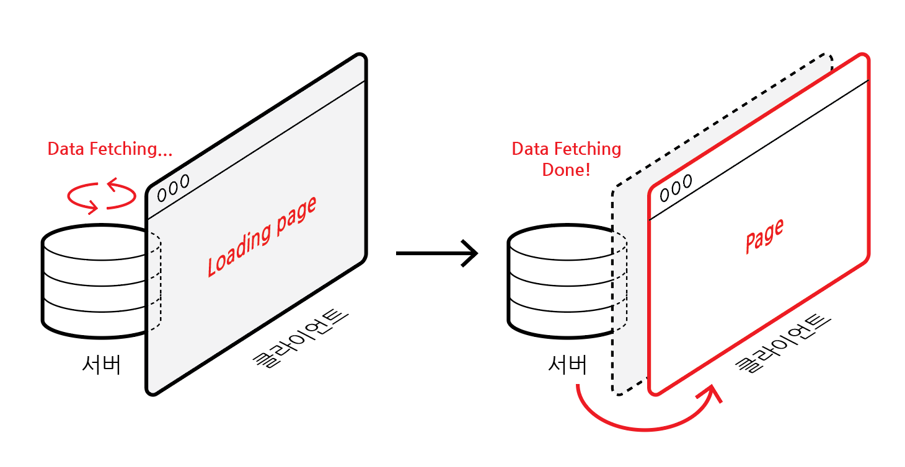
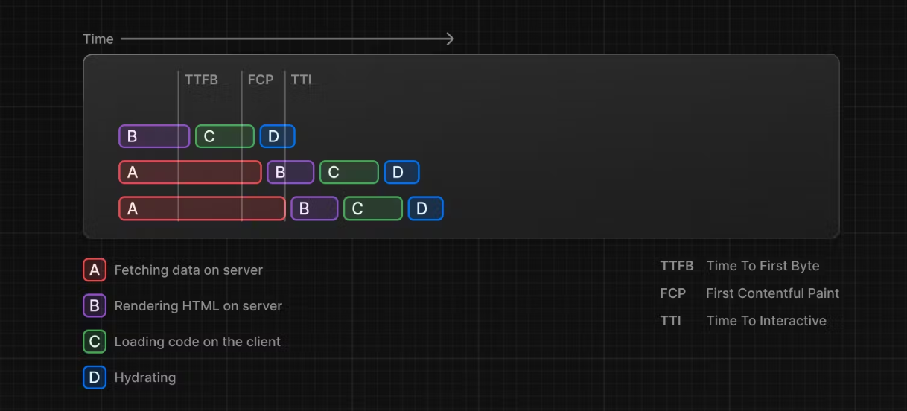

# Loading component

## 1. Loading 페이지

- Server Component에서 Data Fetch 시, 보안적으로 우수하나 fetch 시간이 오래 걸리면 그만큼 로딩 시간이 길어져 사용자에게 화면이 보이지 않게 되는 문제가 있음

### 1-1. loading.tsx 생성

- 폴더 내에 `loading.tsx` 파일을 생성함
- 반드시 파일명이 `loading`이여야 하며, Data fetch가 완료된 후, 보여질 `page.tsx 파일과 동일한 위치`에 있어야 함
- 내보내는 함수 컴포넌트 이름은 아무렇게 지어도 상관없음

```tsx
// app/(home)/loading.tsx

export default function Loading() {
  return <h2>Loading...</h2>;
}
```

- 로딩되는 동안 loading 페이지가 화면에 출력됨
- Next.js는 Server Component가 fetch를 끝내면, 바꿔서 page를 출력함
- 사용자 경험적으로 나아짐

<br>

<p align="center">
    <br/>
    <span>loading 페이지와 fetching된 데이터를 담은 페이지 전환 과정</span>
</p>

<br>

<p align="center">
    <br/>
    <span>로딩 화면</span>
</p>

<br/>

### 1-2. streaming

- Next.js가 페이지를 작은 html 부분으로 나누고(chunk) 준비되는 부분부터 하나씩 보여줌
- 동시에 여러 데이터를 fetch할 수 있음



출처 : [Next.js 공식 사이트 - Loading UI and Streaming](https://nextjs.org/docs/app/building-your-application/routing/loading-ui-and-streaming#what-is-streaming)

<br>

### 1-3. 영화 디테일 로딩 페이지

```tsx
// app/(movies)/movies/[id]/loading.tsx

export default function Loading() {
  return <h2>Loading a movie :id</h2>;
}
```

<br>

<p align="center">
    <br/>
    <span>영화 디테일 로딩 페이지</span>
</p>

[//]: # (---)

[//]: # ()

[//]: # (## Source)

[//]: # ()

[//]: # (- [<>]&#40;<>&#41;)

