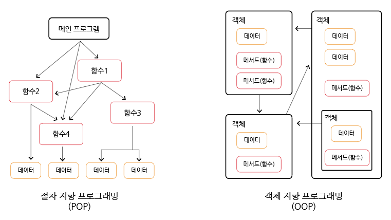
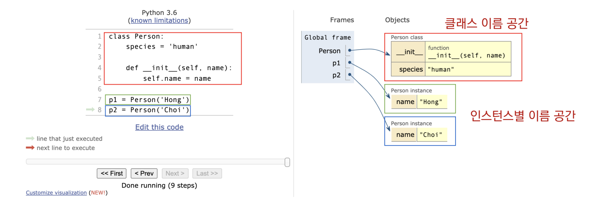
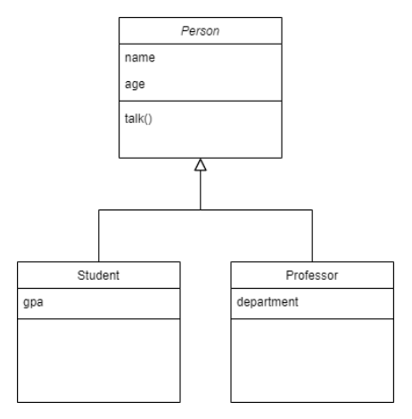

# 클래스

## 1. 객체 지향 프로그래밍

- 파이썬은 모두 객체(object)로 이뤄져 있다. 객체는 특정 타입의 인스턴스(instance)이다.

- 123, 900, 5 는 모두 int의 인스턴스
- 'hello', 'world' 는 모두 string의 인스턴스
- [123, 45, 6], [] 은 모두 list의 인스턴스

<br>

### 1-1. 객체

- 객체(object)의 특징
    - 타입(type): 어떤 연산자(operator)와 조작(method)이 가능한가
    - 속성(attribute): 어떤 상태(데이터)를 가지는가
    - 조작법(method): 어떤 행위(함수)를 할 수 있는가

<br>

### 1-2. 절차 지향 프로그래밍(POP, Procedure Oriented Programming)

- 개념

    - 프로그램을 실행하는데 필요한 절차나 단계를 중심으로 설계됨
    - 프로그램은 주로 함수 또는 서브루틴의 모음으로 이루어짐
    - 데이터와 함수(절차)가 별도로 존재하며, 데이터를 처리하기 위한 절차를 차례대로 실행하는 방식

- 구조

    - 프로그램의 구조가 단계별로 나뉘어져 있음
    - 데이터와 함수가 분리되어 있어 데이터가 변경되면 해당 데이터를 처리하는 함수도 변경이 필요

- 재사용성과 확장성

    - 함수를 재사용하는데 중점
    - 코드의 재사용성이 낮을 수 있고, 큰 프로젝트에서 유지보수가 어려움

- 대표적인 언어
    - C언어

```python
# ex) 사각형 넓이 및 둘레 구하기(절차 지향 프로그래밍)

a = 10
b = 30

square1_area = a * b
square1_circumference = 2 * (a + b)

c = 300
d = 20

square2_area = c * d
square2_circumference = 2 * (c + d)
```

<br>

### 1-3. 객체 지향 프로그래밍(OOP, Object Oriented Programming)

- 개념

    - 프로그램을 여러 개의 독립된 객체들과 그 객체들 간의 상호작용으로 파악하는 프로그래밍 방법
    - 객체는 데이터와 그 데이터를 처리하는 메서드(함수)를 함께 포함하는 캡슐화된 개념
    - 상속, 다형성, 캡슐화와 같은 개념을 통해 유연하고 모듈화된 코드 작성이 가능

- 구조

    - 프로그램을 객체 단위로 설계하며, 객체 간의 상호작용이 중요
    - 데이터와 해당 데이터를 처리하는 메서드가 객체 내부에 캡슐화되어 있어 데이터 변경에 따른 영향이 해당 객체 내부로 제한

- 재사용성과 확장성

    - 객체의 재사용성이 높음
    - 캡슐화를 통해 모듈화되어 있어 객체를 쉽게 재사용하고, 상속 등을 통해 쉽게 확장 가능

- 대표적인 언어
    - Java, C++, Python 등

```python
# ex) 사각형 넓이 및 둘레 구하기(객체 지향 프로그래밍)

def area(x, y):
    return x * y


def circumference(x, y):
    return 2 * (x + y)


a = 10
b = 30
c = 300
d = 20

square1_area = area(a, b)
square1_circumference = circumference(a, b)
square2_area = area(c, d)
square2_circumference = circumference(c, d)

-----------------------------------------------------


# 클래스 적용

class Rectangle:
    def __init__(self, x, y):
        self.x = x
        self.y = y

    def area(self):
        return self.x * self.y

    def circumference(self):
        return 2 * (self.x + self.y)


r1 = Rectangle(10, 30)
r1.area()
r1.circumference()

r2 = Rectangle(300, 20)
r2.area()
r2.circumference()
```

- 사각형: 클래스(class)
- 각각의 사각형(r1, r2): 인스턴스(instance)
- 사각형의 정보: 속성(attribute)
    - 가로 길이, 세로 길이
- 사각형의 행동/기능: 메서드(method)
    - 넓이 구하기, 높이 구하기

<br>

### - 정리

<OOP와 POP 비교>



-   절차 지향 프로그래밍(POP)
    : 데이터와 함수로 인한 변화

-   객체 지향 프로그래밍(OOP)
    : 데이터와 기능(메소드) 분리, 추상화된 구조로 프로그램을 유연하고 변경에 용이하게 하므로 대규모 소프트웨어 개발에 많이 사용된다. 또한 개발과 보수를 간편하게 하고, 직관적으로 코드를 분석할 수 있게 하는
    장점이 있다.

<br>
<br>

## 2. 클래스와 인스턴스

### 2-1. 기본 문법

```python
# 클래스 정의
class MyClass:
    pass


# 인스턴스 생성
my_instance = MyClass()

# 메서드 호출
my_instance.my_method()

# 속성
my_instance.my_attribute
```

<br>

### 2-2. 정의

### - 클래스

- 객체들의 분류(class)

<br>

[클래스 메소드]

- 클래스가 사용할 메소드
- @classmethod 데코레이터를 사용하여 정의
    - 데코레이터: 함수를 어떤 함수로 꾸며서 새로운 기능을 부여
- 호출 시, 첫 번째 인자로 클래스(cls)가 전달됨

```python
# ex)

class MyClass:

    @classmethod
    def class_method(cls, arg1, arg2, ...)


MyClass.class_method(...)
```

<br>

[스태틱 메소드]

- 인스턴스나 클래스를 사용하지 않는 메소드
- @staticmethod 데코레이터를 사용하여 정의
- 호출 시, 어떠한 인자도 전달되지 않음(클래스 및 인스턴스 정보에 접근/수정 불가)

```python
# ex)

class MyClass:

    @staticmethod
    def static_method(arg1, arg2, ...)


MyClass.static_method(...)
```

<br>

[메소드 정리]

- 인스턴스나 클래스를 활용하거나 조작하지 않는 경우?

    - 스태틱 메소드로 정의함, 전달되는 인자 없음

- 인스턴스를 활용하거나 조작하는 경우?

    - 인스턴스 메소드로 정의하고, 첫 번째 인자로 전달된 인스턴스를 조작(일반적으로 self)

- 클래스를 활용하거나 조작하는 경우?
    - 클래스 메소드로 정의하고, 첫 번째 인자로 전달된 클래스를 조작(일반적으로 cls)

```python
# ex)

class MyClass:

    # 인스턴스 메소드 - 인스턴스를 활용하거나 조작
    def method(self):
        return 'instance method', self

    # 클래스 메소드 - 클래스를 활용하거나 조작
    @classmethod
    def classmethod(cls):
        return 'class method', cls

    # 스태틱 메소드 - 인스턴스나 클래스를 활용하거나 조작하지 않음
    @staticmethod
    def staticmethod():
        return 'static method'
```

<br>

[인스턴스와 클래스 간의 이름 공간(namespace)]

- 클래스를 정의하면, 클래스와 해당하는 이름 공간 생성
- 인스턴스를 만들면, 인스턴스 객체가 생성되고, 이름 공간 생성
- 인스턴스에서 특정 속성에 접근하면, 인스턴스 - 클래스 순으로 탐색



<br>

### - 인스턴스

- 하나 하나의 실체/예(instance)

- 파이썬은 모든 것이 객체, 모든 객체는 특정 타입의 인스턴스!

<br>

[인스턴스 변수]

- 인스턴스가 개인적으로 가지고 있는 속성(attribute)
- 각 인스턴스 들의 고유한 변수
- 생성자 메소드에서 self.<name>으로 정의
- 인스턴스가 생성된 이후, <instance>.<name>으로 접근 및 할당

```python
# ex)

class Person:
    def __init__(self, name):
        self.name = name  # 인스턴스 변수 정의


tom = Person('tom')
print(tom.name)  # 인스턴스 변수 접근

출력
# 'tom'

tom.name = 'james'  # 인스턴스 변수 할당
print(tom.name)

출력
# 'james'
```

<br>

[인스턴스 메소드]

- 인스턴스 변수를 사용하거나, 인스턴스 변수에 값을 설정하는 메소드
- 클래스 내부에 정의되는 메소드의 기본
- 호출 시, 첫번째 인자로 인스턴스 자기자신(self)이 전달됨

```python
# ex)

class MyClass:

    def instance_method(self, arg1, arg2, ...)


my_instance = MyClass()
my_instance.instance_method(...)
```

<br>

[self]

- 인스턴스 자기자신
- 파이썬에서 인스턴스 메소드는 호출 시, 첫번째 인자로 인스턴스 자신이 전달되도록 설계
    - 매개변수 이름으로 self를 첫번때 인자로 정의
    - 다른 단어로 써도 작동하지만, 파이썬의 암묵적인 규칙

<br>

### - 속성

- 특정 데이터 타입/클래스의 객체들이 가지게 될 상태/데이터를 의미

```python
# ex)

class Person:
    def __init__(self, name):
        self.name = name


person1 = Person('철수')
person1.name

# 출력
# '철수'

# 클래스 Person은 name 속성으로 '철수'를 받음
```

<br>

### - 메소드

- 특정 데이터 타입/클래스의 객체에 공통적으로 적용 가능한 행위(함수)

```python
# ex)

class Person:
    def talk(self):
        print('안녕')

    def eat(self, food):
        print(f'{food}를 먹다')


person1 = Person()

person1.talk()

# 출력
# '안녕'

person1.eat('피자')

# 출력
# '피자를 먹다'

person1.eat('치킨')

# 출력
# '치킨을 먹다'
```

<br>

[생성자(constructor) 메소드]

- 인스턴스 객체가 생성될 때, 자동으로 호출되는 메소드
- 인스턴스 변수들의 초기값을 설정
    - 인스턴스 생성
    - \_\_init\_\_ 메소드 자동 호출

```python
# ex)

class Person:
    def __init__(self):
        print('인스턴스가 생성되었습니다.')


person1 = Person()

# 출력
# '인스턴스가 생성되었습니다.'

--------------------------------------------------


class Person:
    def __init__(self, name):
        print(f'인스턴스가 생성되었습니다. {name}')


person1 = Person('철수')

# 출력
# '인스턴스가 생성되었습니다. 철수'
```

<br>

[소멸자(destructor) 메소드]

- 인스턴스 객체가 소멸(파괴)되기 직전에 호출되는 메소드

```python
# ex)

class Person:
    def __del__(self):
        print('인스턴스가 사라졌습니다.')


person1 = Person()
del person1

# 출력
# '인스턴스가 사라졌습니다.'
```

<br>

[매직 메소드]

- Double underscore(\_\_)가 있는 메소드는 특수한 동작을 위해 만들어진 메소드로 스페셜 메소드 혹은 매직 메소드라고 불림
- 특정 상황에 자동으로 불리는 메소드
- 종류 및 예시

```python
__str__(self),
__len__(self),
__repr__(self),
__lt__(self, other),
__le__(self, other),
__eq__(self, other),
__gt__(self, other),
__ge__(self, other),
__ne__(self, other)

--------------------------------------------------


class Circle:

    def __init__(self, r):
        self.r = r

    def area(self):
        return 3.14 * self.r * self.r

    # __str__
    # 해당 객체 출력 시 자동으로 호출되며, 출력 형태를 지정한다.
    # 어떤 인스턴스를 출력하면 __str__의 return 값이 출력
    def __str__(self):
        return f'[원] radius: {self.r}'

    # __gt__
    # 부등호 연산자(>, greater than)
    def __gt__(self, other):
        return self.r > other.r


c1 = Circle(10)
c2 = Circle(1)

print(c1)

# 출력
# '[원] radius: 10'

print(c2)

# 출력
# '[원] radius: 1'

c1 > c2

# 출력
# True

c1 < c2

# 출력
# False
```

<br>

### - 객체 비교하기

- ==

    - 동등한(equal)을 의미
    - 변수가 참조하는 객체가 동등한(= 내용이 같은) 경우, True
    - 두 객체가 같아 보이지만 실제로 동일한 대상을 가리키고 있다고 확인해 준 것은 아님

- is
    - 동일한(identical)을 의미
    - 두 변수가 동일한 객체를 가리키는 경우, True

```python
ex)

a = [1, 2, 3]
b = [1, 2, 3]

print(a == b, a is b)

출력
# True, False

- ------------------------------------

a = [1, 2, 3]
b = a

print(a == b, a is b)

출력
# True, True
```

<br>
<br>

## 3. 상속

### 3-1. 클래스 상속

### - 상속

- 두 클래스 사이 부모 - 자식 관계를 정립하는 것
- 모든 파이썬 클래스는 object를 상속 받음
- 부모에 정의된 속성이나 메서드를 활용하거나 오버라이딩(재정의)를 하여 활용
- 코드의 재사용성을 높이고, 클래스 간의 계층적 관계를 활용함

```python
class ChildClass(ParentClass):
    pass
```

<br>

### 3-2. 상속 관련 함수와 메서드

### - isinstance(object, classinfo)

- classinfo의 instance거나 subclass인 경우 True

```python
# ex)

# 상속이 없는 경우

class Person:
    pass


class Professor:
    pass


class Student:
    pass


# 인스턴스 생성
p1 = Professor()
s1 = Student()

print(isinstance(p1, Person))
print(isinstance(p1, Professor))
print(isinstance(p1, Student))

print(isinstance(s1, Person))
print(isinstance(s1, Professor))
print(isinstance(s1, Student))

# 출력
# False
# True
# False

# False
# False
# True

------------------------------------------------


# 상속인 경우

class Person:
    pass


class Professor(Person):  # Person 클래스 상속
    pass


class Student(Person):  # Person 클래스 상속
    pass


# 인스턴스 생성
p1 = Professor()
s1 = Student()

print(isinstance(p1, Person))
print(isinstance(p1, Professor))
print(isinstance(p1, Student))

print(isinstance(s1, Person))
print(isinstance(s1, Professor))
print(isinstance(s1, Student))

# 출력
# True # 상속된 부모 Person도 True
# True
# False

# True # 상속된 부모 Person도 True
# False
# True
```

<br>

### - issubclass(class, classinfo)

- class가 classinfo의 subclass면 True
- classinfo는 클래스 객체의 튜플일 수 있으며, classinfo의 모든 항목을 검사

```python
# ex)

issubclass(bool, int)

# 출력
# True

issubclass(float, int)

# 출력
# False

issubclass(Professor, Person)

# 출력
# True

issubclass(Professor, (Person, Student))

# 출력
# 출력
```

<br>

### - super()

- 자식클래스에서 부모클래스를 사용하고 싶은 경우 활용

```python
# ex)

# 일반적인 방법
class Person:
    def __init__(self, name, age, number, email):
        self.name = name
        self.age = age
        self.number = number
        self.email = email


class Student(Person):
    def __init__(self, name, age, number, email, student_id):
        self.name = name
        self.age = age
        self.number = number
        self.email = email
        self.student_id = student_id


-----------------------------------------------------


# super() 을 이용
class Person:
    def __init__(self, name, age, number, email):
        self.name = name
        self.age = age
        self.number = number
        self.email = email


class Student(Person):
    def __init__(self, name, age, number, email, student_id):
        # Person 클래스
        super().__init__(name, age, number, email)
        self.student_id = student_id
```

<br>

### 3-3. 상속을 통한 메서드 재사용



```python
# ex)

class Person:
    def __init__(self, name, age):
        self.name = name
        self.age = age

    def talk(self):
        print(f'반갑습니다. {self.name}입니다.')


class Professor(Person):
    def __init__(self, name, age, department):
        self.name = name
        self.age = age
        self.department = department


class Student(Person):
    def __init__(self, name, age, gpa):
        self.name = name
        self.age = age
        self.gpa = gpa


p1 = Professor('박교수', 50, '컴퓨터공학과')
s1 = Student('조정곤', 27, 4.3)

# 부모 Person 클래스의 talk 메서드 활용
p1.talk()

# 출력
# '반갑습니다. 박교수입니다.'

# 부모 Person 클래스의 talk 메서드 활용
s1.talk()

# 출력
# '반갑습니다. 조정곤입니다.'
```

<br>

### 3-4. 메서드 오버라이딩

- 상속 받은 메서드를 재정의
    - 상속받은 클래스에서 같은 이름의 메서드로 덮어씀
    - 부모 클래스의 메서드를 실행시키고 싶은 경우, super를 사용

```python
# ex)

class Person:
    def __init__(self, name):
        self.name = name

    def talk(self):
        print(f'반갑습니다. {self.name}입니다.')


# 자식클래스 - Professor
class Professor(Person):
    def talk(self):
        print(f'{self.name}일세.')


# 자식클래스 - Student
class Student(Person):
    def talk(self):
        super().talk()
        print(f'저는 학생입니다.')


p1 = Professor('김교수')
p1.talk()

# 출력
# '김교수일세.'

s1 = Student('조정곤')
s1.talk()

# 출력
# '반갑습니다. 조정곤입니다.'
# '저는 학생입니다.'
```

<br>

### 3-5. 다중 상속

- 파이썬은 두 개 이상의 클래스를 상속 받을 수 있음
- 상속 받은 모든 클래스의 요소를 활용 가능함
- 중복된 속성이나 메서드가 있는 경우, 상속 순서에 의해 결정됨

```python
# ex)

class Person:
    def __init__(self, name):
        self.name = name

    def greeting(self):
        return f'안녕, {self.name}'


class Mom(Person):
    gene = 'XX'

    def swim(self):
        return '엄마가 수영'


class Dad(Person):
    gene = 'XY'

    def walk(self):
        return '아빠가 걷기'


class FirstChild(Dad, Mom):  # 아빠가 먼저 상속됨
    def swim(self):
        return '첫째가 수영'

    def cry(self):
        return '첫째가 응애'


baby1 = FirstChild('아가')
baby1.cry()

# 출력
# '첫째가 응애'

baby1.swim()

# 출력
# '첫째가 수영'

baby1.walk()

# 출력
# '아빠가 걷기'

baby1.gene

# 출력
# 'XY'

-----------------------------------------------------


class Person:
    def __init__(self, name):
        self.name = name

    def greeting(self):
        return f'안녕, {self.name}'


class Mom(Person):
    gene = 'XX'

    def swim(self):
        return '엄마가 수영'


class Dad(Person):
    gene = 'XY'

    def walk(self):
        return '아빠가 걷기'


class SecondChild(Mom, Dad):  # 엄마가 먼저 상속됨
    def walk(self):
        return '둘째가 걷기'

    def cry(self):
        return '둘째가 응애'


baby2 = SecondChild('애기')
baby2.cry()

# 출력
# '둘째가 응애'

baby2.walk()

# 출력
# '둘째가 걷기'

baby2.swim()

# 출력
# '엄마가 수영'

baby2.gene

# 출력
# 'XX'
```

[//]: # (---)

[//]: # ()

[//]: # (## Source)

[//]: # ()

[//]: # (- SEO 기본 가이드)

[//]: # ()

[//]: # (  [<https://support.google.com/webmasters/answer/7451184?hl=ko&ref_topic=9460495>]&#40;<https://support.google.com/webmasters/answer/7451184?hl=ko&ref_topic=9460495>&#41;)