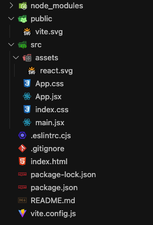
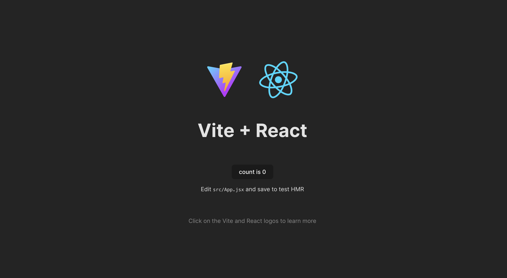

# Vite를 이용한 React 설치

## 1. 설치 방법

### 1-1. Vite로 설치

```bash
$ npm init vite
```

- 명령어 실행 후, 폴더(프로젝트) 명, 라이브러리, 언어 옵션을 선택하면 프로젝트가 생성됨

<p align="center">
    <br/>
    <span>Vite로 생성한 React 폴더 및 파일</span>
</p>

<br/>

### 1-2. dependency 설치

```bash
$ npm install
```

<br/>

### 1-3. 서버 실행하기

```bash
$ npm run dev
```

- localhost:5173 포트에서 실행되는 것을 확인 할 수 있음

<p align="center">
    <br/>
    <span>Vite로 생성한 React 초기화면</span>
</p>

[//]: # (---)

[//]: # ()

[//]: # (## Source)

[//]: # ()

[//]: # (- [<>]&#40;<>&#41;)

